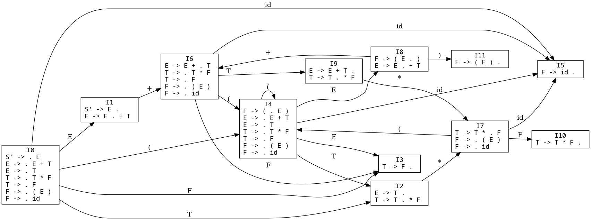

# 🧪 实验三报告：构建 LR(0) 项目集规范族

---

##  一、实验目的

本实验旨在基于给定上下文无关文法，构建其对应的 LR(0) 项目集规范族，并可视化项目集状态间的转移图，为后续实现 SLR(1) 分析器提供基础。

---

##  二、理论依据

本实验的理论基础来自《编译原理》第八章中对 LR 分析的定义和推导，包括：

* **LR 分析方法**：是一种自下而上的分析方法，依赖分析栈和状态驱动。
* **LR(0) 项目**：形式为 `A → α·β`，表示当前推导已完成 `α`，待处理 `β`。
* **闭包（closure）操作**：用于补全所有可能推导项。
* **转移函数（GOTO）**：表示当前状态在读入符号 X 后跳转到新状态的结果。
* **项目集规范族**：通过从 I₀ 反复 GOTO 构造所有可能状态（DFA）。

---

##  三、实现结构与模块设计

###  目录结构

```
lab3/
├── grammar/    // 文法定义与产生式处理
├── item/       // LR(0) 项、闭包、GOTO函数
├── parser/     // 项目集规范族、分析表构造
├── driver/     // 分析器运行与过程可视化
└── main.go     // 实验主入口
```

### 🔧 各模块说明

| 模块                 | 功能描述                                      |
| ------------------ | ----------------------------------------- |
| `grammar`          | 定义文法结构：非终结符、终结符、产生式集合                     |
| `item`             | 定义 LR(0) 项结构，实现 `Closure()` 与 `Goto()` 算法 |
| `parser/dfa.go`    | 构造 LR(0) 项目集规范族 DFA（I₀ \~ In）             |
| `parser/table.go`  | 构造 ACTION / GOTO 分析表                      |
| `driver/parser.go` | 实现分析器执行过程，记录并导出流程图                        |
| `main.go`          | 加载文法、生成 DFA、运行分析器并导出可视化结果                 |

---

##  四、实现细节

###  增广文法构造

自动添加 `S' → S` 形式的起始产生式，以便统一接受状态。

###  项目集规范族构建

从初始项集 `I₀ = closure({S' → ·S})` 出发，不断枚举 GOTO：

* 用 `map[string]int` 哈希去重
* 每个项集自动编号为 I0、I1、I2...

###  DFA 状态图生成

* 节点：每个项集 Iₙ，显示其项目内容
* 边：GOTO(I, X) ⇒ J，显示符号 X 的转移

使用 Graphviz `.dot` 输出为 `dfa.dot` 文件

---

##  五、实验示例与结果

###  输入文法：

```
S' → E
E  → E + T | T
T  → T * F | F
F  → (E) | id
```

###  输出结果：

* 共生成 I₀ \~ I₁₁ 共 12 个项目集
* 状态转移图导出为 `dfa.dot → dfa.png`
* 分析过程（如对 `id + id * id`）如下：

```
状态栈: [0]     符号栈: [#]       输入: id     动作: shift → 5
状态栈: [0 5]   符号栈: [# id]    输入: +      动作: reduce → F → id
状态栈: [0 3]   符号栈: [# F]     输入: +      动作: reduce → T → F
...
状态栈: [0 1]   符号栈: [# E]     输入: #      动作: 接受 ✅
```

###  分析流程图输出：

使用 DOT 导出分析步骤为 `parse_flow.dot`，渲染图如下：

* 每个节点展示 Step N、当前状态栈、符号栈、输入、动作
* 使用颜色区分：`shift`（蓝）、`reduce`（绿）、`accept`（黄）

---

##  六、实验收获与反思

###  收获

* 熟悉了 LR(0) 分析方法的底层结构
* 深入理解了闭包、转移、规约、移进过程
* 利用 Go 实现了从文法到图形的全流程分析器
* 学会将过程可视化，便于调试与教学展示

###  不足与改进点

* 当前分析树未输出，适用于过程可视化，不适合语义翻译
* 图结构在输入较长时仍会爆炸（可引入节点折叠优化）
* LR(0) 本身分析能力有限，部分文法存在冲突（待 SLR 扩展）

---


