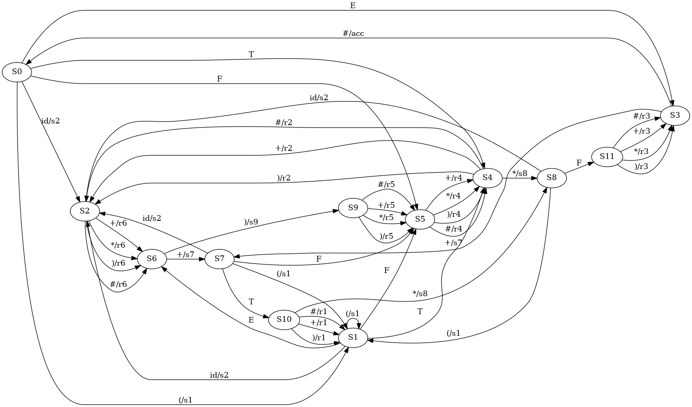
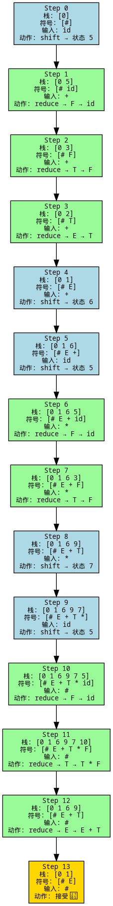

---

# 📘 实验四：SLR(1) 分析表构造与语法分析器实现


## 一、实验目的

* 理解 LR(0) 与 SLR(1) 的差异；
* 构建给定文法的 FOLLOW 集；
* 基于 LR(0) 项目集与 FOLLOW 集生成 SLR(1) 分析表；
* 实现 SLR(1) 分析器，模拟移进-归约分析流程；
* 输出分析过程与分析表，辅助调试与验证。

---

## 二、实验内容与要求

1. **输入**：实验三输出的 DFA（LR(0) 项目集规范族）与增广文法；
2. **构造**：

   * 构造每个非终结符的 FOLLOW 集；
   * 构造 SLR(1) 分析表（ACTION / GOTO）；
3. **分析器实现**：

   * 使用栈模拟语法分析过程；
   * 支持移进、归约、接受等操作；
   * 输出每一步状态栈、符号栈、输入符号与动作；
4. **输出**：

   * ACTION / GOTO 表（终端与 DOT 图）；
   * 分析流程图（parse\_flow\.dot）；
   * DFA 状态图（dfa.dot）。

---

## 三、理论基础

### 1. SLR(1) 分析原理

SLR(1) 是在 LR(0) 分析的基础上引入 FOLLOW 集来消解冲突。
其基本思想如下：

* 对 `[A → α·]` 项，仅在 **FOLLOW(A)** 中的终结符上填写规约动作；
* 对 `[A → α·aβ]` 项，对符号 `a` 填写移进动作；
* 起始符号接受项 `[S' → S·]` 对 `#` 填入 `acc`。

### 2. FOLLOW 集构造规则

对于文法产生式 `A → αBβ`：

* 若 β 可导出 ε，则 `FOLLOW(B) ⊇ FOLLOW(A)`
* 否则 `FOLLOW(B) ⊇ FIRST(β) \ {ε}`

---

## 四、实现结构与说明

### 项目结构概览：

```
lab4/
├── grammar/      ← 文法结构、FIRST、FOLLOW 集实现
├── item/         ← 项目与闭包、Goto 算法
├── parser/       ← DFA 构建、分析表生成、导出模块
├── driver/       ← 分析流程模拟器
└── main.go       ← 实验入口
```

### 关键模块功能：

| 模块         | 文件                  | 主要功能                         |
| ---------- | ------------------- | ---------------------------- |
| 文法表示与符号集   | `grammar.go`        | 定义 Symbol、Production、Grammar |
| FIRST 集计算  | `grammar/follow.go` | 递归构造每个符号的 FIRST 集            |
| FOLLOW 集计算 | `grammar/follow.go` | 按教材规则迭代构造 FOLLOW 集           |
| LR(0) 项目集  | `item/item.go`      | 生成闭包、Goto 集合                 |
| DFA 构建     | `parser/dfa.go`     | 构建 LR(0) 项目集规范族 DFA          |
| 分析表构造      | `parser/table.go`   | 构建 SLR(1) 表（支持 FOLLOW）       |
| 分析过程执行     | `driver/parser.go`  | 模拟分析栈，输出步骤与 DOT 图            |

---

## 五、实验输出结果


* 分析流程图：`parse_flow.dot` → 使用 `dot -Tpng` 可转换为分析图；
* DFA 状态图：`dfa.dot`；
* 分析表图：`parse_table.dot`




---

## 六、实验总结与收获

* 理解了 **SLR(1)** 是如何在 LR(0) 基础上引入 FOLLOW 集消解冲突；
* 深刻体会了 **FOLLOW 集构造规则** 与算法迭代过程；
* 实现了完整的分析器结构并成功运行；
* 结合 `.dot` 图实现可视化，便于调试 DFA 与分析过程；
* 初步实现了编译器前端中的语法分析器部分，为后续语义分析和中间代码生成打下基础。

---

## 七、改进与展望

* 当前项目支持 **标准单产生式文法**，若后续文法扩展，应增加 ε 处理、错误恢复；
* 可进一步实现 **LALR(1)** 分析器提升文法支持能力；
* 可将此模块与词法分析（实验二）自动连接，构建完整前端。

---

