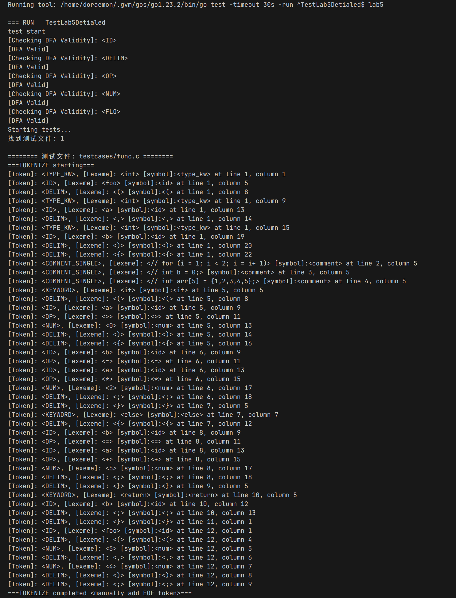
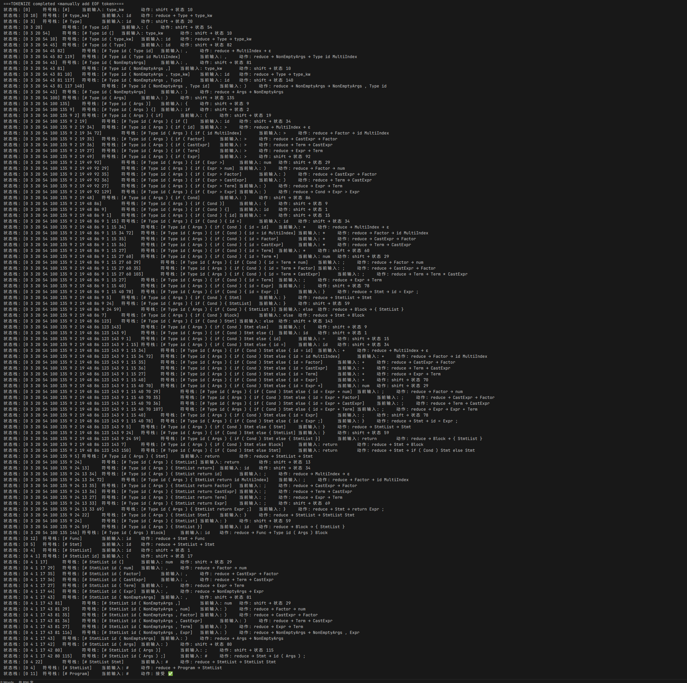
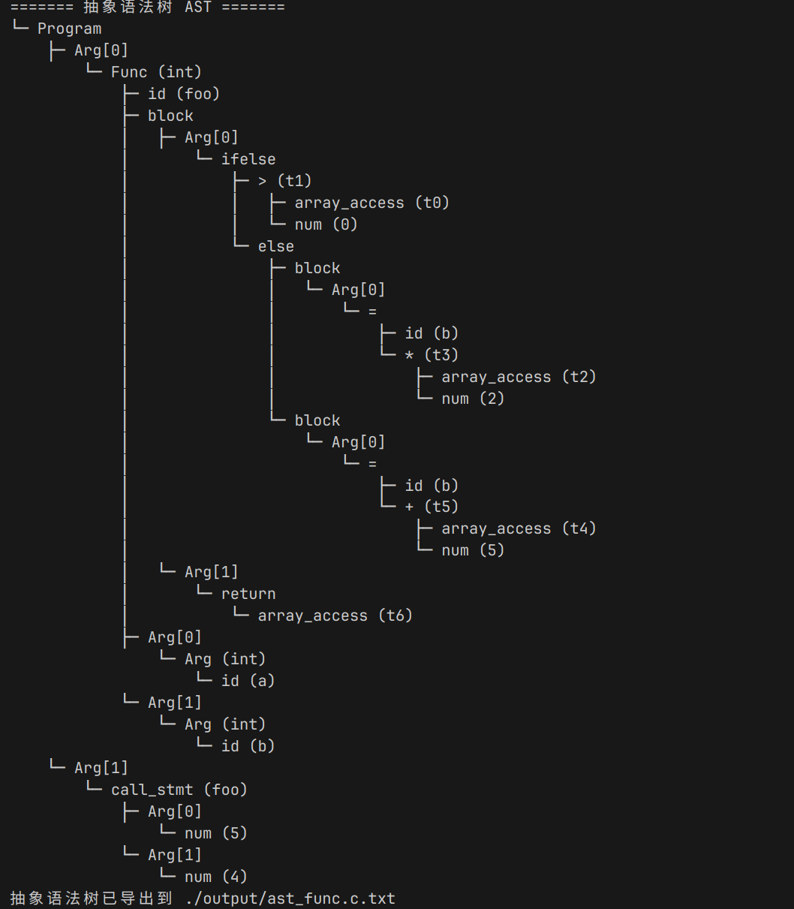

---

# 💻 实验报告5：编译器前端实验 —— 抽象语法树构建

---

## 一、实验目的

1. 理解词法分析、语法分析在编译器前端中的作用与基本流程；
2. 掌握 DFA 构建与多状态机词法分析器的设计方法；
3. 掌握 LR(0)/SLR(1) 分析器的原理与程序化实现；
4. 学会从语法归约动作构建抽象语法树（AST）；
5. 为后续语义分析与中间代码生成建立语法结构基础。

---

## 二、实验环境

| 项目    | 配置                          |
| ----- | --------------------------- |
| 编程语言  | Go 1.23+                    |
| 操作系统  | debian12             |
| 编辑器   | Visual Studio Code  |
| 第三方工具 | Graphviz（可视化 DFA、AST）       |
| 项目结构  | 多模块工程，分为 lexer/parser 等     |

---

## 三、项目结构与模块说明

本项目已集成完成词法分析、语法分析、语法规则定义与 AST 构建，模块说明如下：

### 1. Lexer 模块（词法分析）

* **目标**：将源代码分解为 Token 流；
* **实现方式**：使用多个 DFA 实例分别识别关键字、标识符、常数、操作符等；
* **技术要点**：

  * `dfa/dfa.go` 定义了可复用的 DFA 状态转换结构；
  * `scanner/scanner.go` 构建了词法扫描器，使用最长匹配与优先级选择规则；
  * `scanner/scanner_model.go` 组织所有 Token 类型对应的 DFA 实例；
  * 可将 DFA 输出为 DOT 格式，便于可视化调试。

🖼️ （图1）：
  

---

### 2. Syntax 模块（语法规则）

* **目标**：定义支持的语言文法；
* **实现方式**：以产生式形式注册所有语法规则；
* **支持语句**：

  * 变量声明：`int x = 5;`
  * 表达式：`x + y * 2`
  * 控制结构（if、while）、函数定义等扩展结构
* **技术要点**：

  * `syntax/grammar.go` 定义产生式与符号集；
  * `syntax/follow.go` 计算 FOLLOW 集，用于 SLR(1) 表生成；
  * 支持 FIRST/FOLLOW 自动计算，避免手动冲突处理。

#### 支持的语法
```
S' -> Program

Program -> StmtList | StmtList EOF

Stmt -> Func | Decl | id = Expr ; | return Expr ; | Block 
      | if ( Cond ) Stmt | if ( Cond ) Stmt else Stmt 
      | while ( Cond ) Stmt | id MultiIndex = Expr ; 
      | id ( Args ) ; | for ( ForInit Cond ; Expr ) Stmt

Func -> Type id ( Args ) Block

Decl -> Type id = Expr ; | Type id MultiIndex ; 
      | Type id MultiIndex = Expr ; | Type id MultiIndex = InitList ;

Type -> type_kw

Block -> { StmtList }

StmtList -> ε | Stmt | StmtList Stmt

Expr -> Expr + Term | Expr - Term | Term | InitList | id = Expr
Term -> Term * CastExpr | Term / CastExpr | CastExpr

CastExpr -> CastPrefix Factor | Factor
CastPrefix -> ( Type )

Factor -> id ( Args ) | num | float | char | string | id 
        | ( Expr ) | id MultiIndex | - Factor

Args -> NonEmptyArgs | ε
NonEmptyArgs -> Expr | NonEmptyArgs , Expr
              | Type id | Type id = Expr
              | Type id MultiIndex | Type id MultiIndex = Expr
              | NonEmptyArgs , Type id | NonEmptyArgs , Type id = Expr
              | NonEmptyArgs , Type id MultiIndex | NonEmptyArgs , Type id MultiIndex = Expr

IndexList -> ε | Expr | IndexList , Expr

Cond -> Cond && Cond | Cond || Cond | ! Cond 
      | Expr < Expr | Expr > Expr | Expr <= Expr | Expr >= Expr 
      | Expr != Expr | Expr == Expr | ( Cond ) | Expr

MultiIndex -> ε | [ IndexList ] MultiIndex

InitList -> { } | { NonEmptyInitList }
NonEmptyInitList -> Expr | NonEmptyInitList , Expr

ForInit -> Decl | Expr | ε
``````
S' -> Program

Program -> StmtList | StmtList EOF

Stmt -> Func | Decl | id = Expr ; | return Expr ; | Block 
      | if ( Cond ) Stmt | if ( Cond ) Stmt else Stmt 
      | while ( Cond ) Stmt | id MultiIndex = Expr ; 
      | id ( Args ) ; | for ( ForInit Cond ; Expr ) Stmt

Func -> Type id ( Args ) Block

Decl -> Type id = Expr ; | Type id MultiIndex ; 
      | Type id MultiIndex = Expr ; | Type id MultiIndex = InitList ;

Type -> type_kw

Block -> { StmtList }

StmtList -> ε | Stmt | StmtList Stmt

Expr -> Expr + Term | Expr - Term | Term | InitList | id = Expr
Term -> Term * CastExpr | Term / CastExpr | CastExpr

CastExpr -> CastPrefix Factor | Factor
CastPrefix -> ( Type )

Factor -> id ( Args ) | num | float | char | string | id 
        | ( Expr ) | id MultiIndex | - Factor

Args -> NonEmptyArgs | ε
NonEmptyArgs -> Expr | NonEmptyArgs , Expr
              | Type id | Type id = Expr
              | Type id MultiIndex | Type id MultiIndex = Expr
              | NonEmptyArgs , Type id | NonEmptyArgs , Type id = Expr
              | NonEmptyArgs , Type id MultiIndex | NonEmptyArgs , Type id MultiIndex = Expr

IndexList -> ε | Expr | IndexList , Expr

Cond -> Cond && Cond | Cond || Cond | ! Cond 
      | Expr < Expr | Expr > Expr | Expr <= Expr | Expr >= Expr 
      | Expr != Expr | Expr == Expr | ( Cond ) | Expr

MultiIndex -> ε | [ IndexList ] MultiIndex

InitList -> { } | { NonEmptyInitList }
NonEmptyInitList -> Expr | NonEmptyInitList , Expr

ForInit -> Decl | Expr | ε
```

---

### 3. Parser 模块（语法分析）

* **目标**：将 Token 流还原为语法结构（AST）；
* **实现方式**：

  * 构建 LR(0) 项目集与状态转换图；
  * 使用 ACTION/GOTO 表驱动语法分析；
  * 每次归约时生成 AST 节点；
* **技术要点**：

  * `parser/dfa.go` 构造 LR(0) 状态机；
  * `parser/parser.go` 完成移进-归约分析主流程；
  * `parser/export.go` 支持语法分析图导出为 DOT 文件；
  * `parser/error.go` 捕获分析过程中的语法错误。
🖼️ （图2）：
 


---

### 4. AST 构建模块（semantic/ast.go）

* **目标**：通过语法归约规则生成抽象语法树（AST）；
* **实现方式**：

  * 每个产生式对应一个 `ActionFuncs` 函数；
  * 使用递归方式构建具有语义信息的 `ASTNode`；
  * 使用 `PrintASTPretty()` 输出树形结构；
* **技术要点**：

  * 支持节点类型分类（Program、Decl、BinaryExpr、If、While 等）；
  * 每个节点记录类型、值、左右子树或参数数组；
  * 可拓展用于后续语义检查与中间代码生成。

🖼️ （图3）：
    


---


## 五、实验总结与思考

本实验完整实现了一个基于 Go 的编译器前端，涵盖词法分析、语法分析与 AST 构建三个核心阶段。通过 DFA 自动机和 LR 分析表的结合使用，语法分析器具备处理复杂文法和嵌套语句的能力。AST 构建部分为后续语义分析、中间代码生成与优化打下良好结构基础。

进一步拓展方向包括：

* 增加类llvm风格CheckEngine；
* 支持更多语法结构如 for、数组、函数调用等；
* 可视化 AST 与 DFA，提高调试体验；
* 融合类型系统与作用域信息进行语义分析。

---

