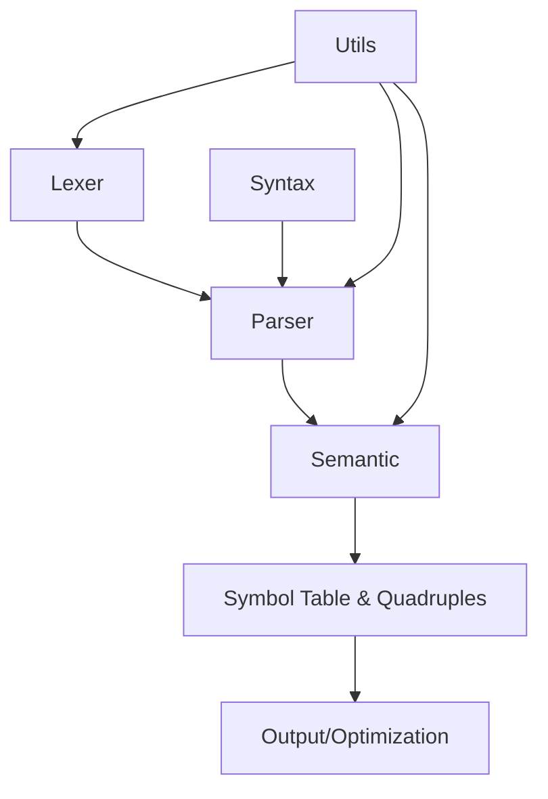
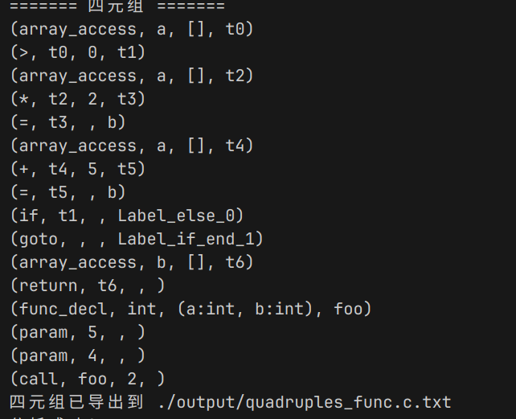
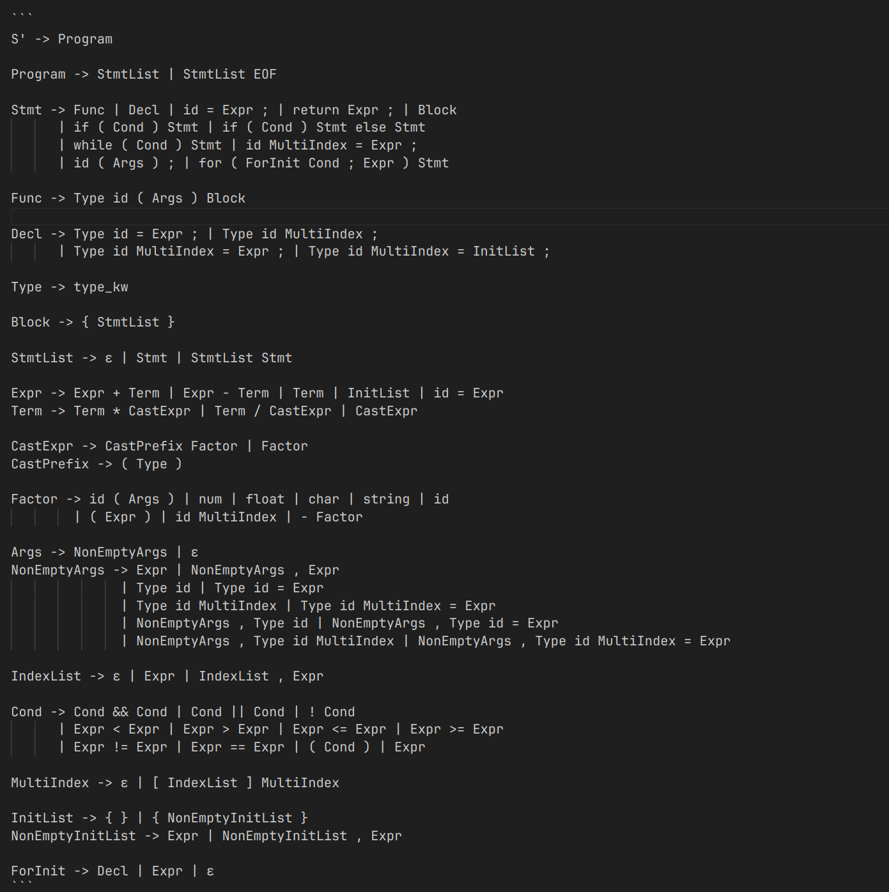

---

# 🧪 实验报告 六：编译器前端实验 —— 四元组生成

---

## 一、实验目的

1. 理解编译器前端的各个阶段：词法分析、语法分析、语义分析；
2. 掌握符号表的建立方法、作用域管理机制和类型检查原则；
3. 理解抽象语法树（AST）的构建方式和递归结构；
4. 掌握中间代码生成方法，使用四元组（Quadruple）表示程序逻辑。

---

## 二、实验环境

| 项目    | 配置                     |
| ----- | ---------------------- |
| 编程语言  | Go 1.23+               |
| 操作系统  | debian        |
| 编辑器   | VSCode / Goland        |
| 第三方工具 | Graphviz（可视化 DFA、AST）  |
| 项目结构  | 模块化工程，含 lexer/parser 等 |

---

## 三、项目模块与实现结构

以下为本编译器项目的完整模块构成及其职责与相互关系：

### 模块一：Lexer（词法分析模块）

* 利用多种 DFA 识别 Token；
* Token 信息包含类型、词素、位置等；
* 输出：Token 流 → 输入 Parser 模块。

### 模块二：Parser（语法分析模块）

* 基于 LR(0)/SLR(1) 表的表驱动语法分析；
* 输入：Token 流；
* 输出：抽象语法树（AST）；
* 报错：非法语法结构。

### 模块三：Semantic（语义分析模块）

* 负责符号表构建与作用域管理；
* 对 AST 进行类型检查与定义检查；
* 生成四元组，表示中间代码逻辑。

### 模块四：Syntax（语法规则模块）

* 定义完整文法（参考支持文法章节）；
* 提供分析表构建的符号和产生式信息。

### 模块五：Utils（工具模块）

* 提供辅助类型映射与符号转换等支持。

---

## 四、模块关系图



---

## 五、核心数据结构与处理流程

### 1. 符号表（Symbol Table）

* 用于管理标识符名称、类型、作用域等；
* 实现嵌套作用域机制（支持局部变量）；
* 每次声明均更新符号表，重复定义时报错。

### 2. 抽象语法树（AST）

* 语法分析阶段通过归约规则递归构建；
* 节点类型包括 Program、Decl、Assign、Expr、If、While 等；
* 每个节点可打印为树形结构。
    
---

### 3. 四元组生成

* 四元组格式为 `(op, arg1, arg2, result)`；
* 每个表达式、赋值语句、控制流语句均对应一个或多个四元组；
* 使用临时变量（如 `t1`、`t2`）保存中间计算结果。

 
---

## 六、实验样例

### 输入源代码（示例）：

```c
int a = 2;
int b = 3;
int c = a + b * 4;
```

### 抽象语法树输出（简略）：

```
Program
├─ DeclStmt
│  ├─ int
│  ├─ id(a)
│  └─ num(2)
├─ DeclStmt
│  ├─ int
│  ├─ id(b)
│  └─ num(3)
└─ DeclStmt
   ├─ int
   ├─ id(c)
   └─ +
      ├─ id(a)
      └─ *
         ├─ id(b)
         └─ num(4)
```

### 四元组输出：

```
(=, 2, _, a)
(=, 3, _, b)
(*, b, 4, t1)
(+, a, t1, t2)
(=, t2, _, c)
```

---

## 七、支持的文法

✅ 所有文法均在 `syntax/grammar.go` 中定义，覆盖函数、表达式、数组、控制流等。完整文法如下：

---

## 八、实验总结与思考

本次实验完整实现了编译器前端全流程，从源代码的字符流开始，通过：

* 多 DFA 实现 Token 扫描；
* LR(0) 分析器生成 AST；
* 使用语义分析构建符号表与类型检查；
* 最终生成中间表示四元组；

为编译器后端提供坚实基础。

📌 可拓展方向：

* 增加数组/函数调用/嵌套作用域支持；
* 优化符号表结构，加入链式作用域与函数签名；
* 引入代码优化模块，如常量折叠、公共子表达式消除；
* 扩展中间代码为三地址码结构或 LLVM IR 表示。

---

