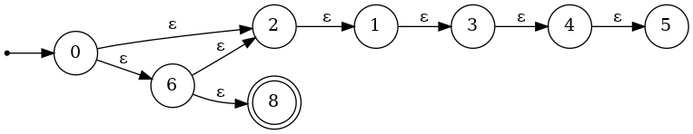

# 作业 1 
网安2201 常兆鑫 2226114409

---

### **习题 1.3（图 1-8 滴木雷石玩具）**

#### （1）用有穷自动机为这个玩具建模：

* **状态集合**：每个装置状态可表示为 $q_1, q_2, q_3$，其中每个状态代表对应的挡板朝某一方向（左或右）。

  * 状态数共 $2^3 = 8$，每个 $x_i$ 有两种状态（左、右）。

* **输入符号**：Σ = {A, B}，表示木球从A口或B口投入。

* **状态转移函数**：根据木球进入装置路径、撞击挡板后的行为决定：

  * 每次木球撞击某挡板，会使其方向反转（即状态变更）；
  * 木球从A或B进入后，依次经过 $x_1 \to x_2 \to x_3$ 等路径，最终到达C、D或E端口。

* **初始状态**：任意一个 3 位比特组合，例如 (L, L, L)。

* **接受状态**：木球从 D 或 E 出口。

* **拒绝状态**：木球从 C 出口。

> 可通过穷举法构建 DFA，其中：

* 每个状态是挡板组合方向；
* 转移规则通过函数 $\nu(q, A) \to q', C/D/E$ 表示状态转移与出口。

#### （2）自然语言描述：

> 滴木雷石玩具有三个装置 $x_1, x_2, x_3$，它们各自有两个方向状态（左/右）。每次有一个木球从 A 或 B 投入，依照当前挡板方向路径向下滚动。每当木球撞击某个挡板，该挡板的方向将反转。最终木球会从 C、D 或 E 中一个出口落出。我们定义从 D 或 E 出口为“接受”，从 C 出口为“拒绝”。

---

### **习题 1.5（2）**

> **试判断符号串 `ε`, `123.`, `+5e6` 是否是“有符号十进制定点数”的符号串。**


因此判断标准为：

* 开头可有符号（+/-）
* 至少一个数字
* 可选的小数点后数字，但必须有数字在点前（即不能是 .123 或 123.）

判断如下：

* `ε`: 空串，不包含任何数字，不符合 
* `123.`: 有数字，但点后没有数字，不符合定点数语法 
* `+5e6`: 是科学计数法，不是定点数 →


---

### **习题 1.7（3）**

> 写出字母表 {+, 0, 1} 上满足以下两个条件的字符串组成的语言 B₀：

1. 串长度不超过 4；
2. 串除以 5 余数为 0；


#### 枚举结果：

| 字符串    | 二进制值 | %5 | 满足？ |
| ------ | ---- | -- | --- |
| `0`    | 0    | 0  | ✅   |
| `1`    | 1    | 1  | ❌   |
| `00`   | 0    | 0  | ✅   |
| `01`   | 1    | 1  | ❌   |
| `10`   | 2    | 2  | ❌   |
| `11`   | 3    | 3  | ❌   |
| `000`  | 0    | 0  | ✅   |
| `001`  | 1    | 1  | ❌   |
| `010`  | 2    | 2  | ❌   |
| `011`  | 3    | 3  | ❌   |
| `100`  | 4    | 4  | ❌   |
| `101`  | 5    | 0  | ✅   |
| `110`  | 6    | 1  | ❌   |
| `111`  | 7    | 2  | ❌   |
| `0000` | 0    | 0  | ✅   |
| `0101` | 5    | 0  | ✅   |
| `+0`   | 0    | 0  | ✅   |
| `+101` | 5    | 0  | ✅   |
| `+000` | 0    | 0  | ✅   |

#### **最终符合 B₀ 的字符串**：

```
B₀ = { "0", "00", "000", "0000", "+0", "+000", "101", "0101", "+101" }
```

* 状态集 Q = {q₀, q₁, q₂, q₃, q₄} 表示当前数 mod 5 的余数；
* 初始状态 q₀；
* 接受状态 F = {q₀}；
* 转移函数 υ(qᵢ, b) = qⱼ，其中 qⱼ = (2·i + b) mod 5；

支持 + 开头，则 + 为 ε 转移或非参与 mod 的字符。

---

##  **习题 2.1 (2)**

> 写出字母表 {0,1} 上“无符号二进制定点数，不含后 0”的 DFA。


### 设计思路：

状态集 Q = {q0, q1, q2}

* q0：初始状态，尚未读入任何字符
* q1：读入至少一个字符，且末位是 `1`
* q2：读入至少一个字符，且末位是 `0`

最终状态：**q1**（意味着最后一个字符是 `1`）

### DFA 转移表：

| 当前状态 | 输入0 | 输入1 |
| ---- | --- | --- |
| →q0  | q2  | q1  |
| q1   | q2  | q1  |
| q2   | q2  | q1  |


---

##  **习题 2.3**

> 设 A 是一个 DFA，a 是 A 的一个输入符号，证明对所有状态 q 有：

$$
\hat{\delta}(q, a^n) = \delta(\hat{\delta}(q, a^{n-1}), a)
$$

### 解：

对正整数 n 归纳。

* **基础情况（n=1）**：

  $$
  \hat{\delta}(q, a^1) = \delta(q, a)
  $$

  成立。

* **归纳假设**：假设对于某 n 有：

  $$
  \hat{\delta}(q, a^n) = \delta(\hat{\delta}(q, a^{n-1}), a)
  $$

* **归纳推理**：

  $$
  \hat{\delta}(q, a^{n+1}) = \delta(\hat{\delta}(q, a^n), a)
  $$

  利用归纳假设右边等于：

  $$
  \delta(\delta(\hat{\delta}(q, a^{n-1}), a), a)
  $$

  所以原式成立。

---

##  **习题 2.4**

> DFA 定义如下：
> 状态集 Q = {A, B}
> 字母表 Σ = {0,1}
> 转移函数：

| 状态 | 0 | 1 |
| -- | - | - |
| A  | A | B |
| B  | B | A |

接受状态 F = {B}
初始状态 q₀ = A

### 语言说明：

* 从初始状态 A 出发，每遇到 `1` 就切换状态，`0` 不变；
* 若遇奇数个 `1` 则在 B，偶数个 `1` 则在 A；
* 所以语言 L = 所有含 **奇数个 1** 的字符串组成的集合。


---

## ✅ **习题 2.6**

> 考虑以下 ε-NFA：

| 状态 → | a   | b   | c   | ε      |
| ---- | --- | --- | --- | ------ |
| →q   | ∅   | {q} | ∅   | {p, r} |
| p    | {p} | ∅   | ∅   | ∅      |
| \*r  | ∅   | ∅   | {r} | ∅      |

---

### (1) 每个状态的 ε闭包：

* ε-closure(q) = {q, p, r}
* ε-closure(p) = {p}
* ε-closure(r) = {r}

---

### (2) 接受长度不超过 3 的串：

构造 ε-NFA 路径如下（从 q 出发）：

* `b`: q → q（via b），q∈ε-closure(q)
* `c`: q → ε→r → c → r ✔
* `a`: q → ε→p → a → p ✔
* `ab`: q → ε→p → a → p → b ×（p 无 b 转移）
* `bc`: q → q → b → q（×）
* `ba`: q → q → b → q（q无a）→×
* `ac`: p 无 c →×
* `cb`: r 无 b →×

故接受的字符串包括：

* `a`
* `b`
* `c`
* `aa`
* `aaa`
* `cc`
* `ccc`
* `ac`, `ca` 等 × 不可达。

合法：`a`, `aa`, `aaa`, `c`, `cc`, `ccc`，最多长为3。

---

### (3) 转换为 DFA：

使用子集构造法（powerset construction）：

初始状态：ε-closure(q) = {q, p, r} = Q₀
构造如下状态子集：

| DFA 状态      | 输入a | 输入b | 输入c | 是否接受  |
| ----------- | --- | --- | --- | ----- |
| {q,p,r} (A) | {p} | {q} | {r} | ✔（含r） |
| {p} (B)     | {p} | ∅   | ∅   | ✘     |
| {q} (C)     | ∅   | {q} | ∅   | ✘     |
| {r} (D)     | ∅   | ∅   | {r} | ✔     |
.png)
---

## ✅ **习题 2.7**

ε-NFA 转移表如图所示：

| 状态  | 0 | 1 | ε   |
| --- | - | - | --- |
| 0   |   |   | 2,6 |
| 1   |   |   | 3   |
| 2   |   |   | 1   |
| 3   |   |   | 4   |
| 4   |   |   | 5   |
| 5   |   |   |     |
| 6   |   |   | 2,8 |
| 7   |   |   | {7} |
| \*8 |   |   |     |

---

### (1) 计算 ε-closure(5)：

* 5 无 ε 转移，故 ε-closure(5) = {5}

---

### (2) 自然语言描述：

该 ε-NFA 接受所有能够从状态 0 通过若干 ε 转移后最终到达状态 8 的串。也即：

* 任意串，只要路径经过 0 →ε→ 2 →ε→ 1 →ε→ 3 →ε→ 4 →ε→ 5
  且 6 →ε→ 8；
* 即接受空串 ε、或构造性 ε-路径串，使其最后到 8。

---

### (3) 转换为 DFA（仅列初步路径，未完整构造）：

初始状态：ε-closure(0) = {0,2,6,1,3,4,5,8} = Q₀

构建状态转移图：

* 状态 Q₀ 是接受态（含 8）
* 根据 ε-NFA 构造子集 DFA 状态及其输入转移（略）

---

如需完整状态转移图或 DOT 图，我可继续为你绘制。是否需要进一步可视化？
