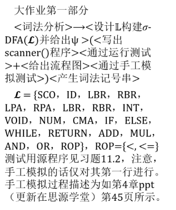
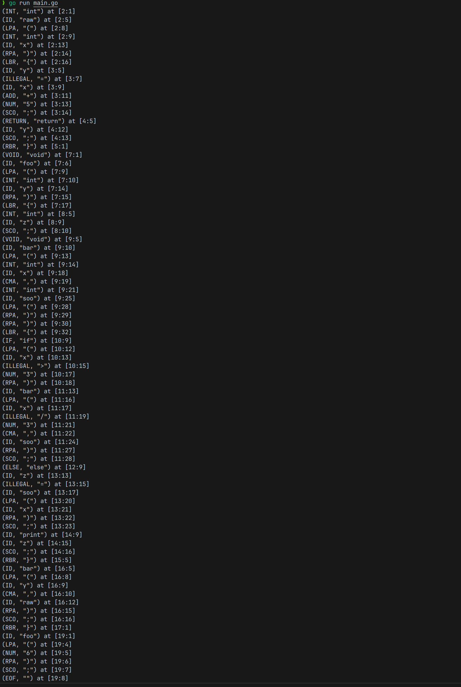

班级： 网安2201
姓名： 常兆鑫
学号： 2226114409

# ✅ 实验报告：词法分析器设计与实现（基于 DFA）

## 一、实验名称

词法分析实验：设计并实现 σ-DFA 及词法分析器，生成词法记号串。

---

## 二、实验目的

本实验旨在通过实现一个词法分析器：

1. **设计 σ-DFA** 来识别给定语言 $\mathcal{L}$ 中的各类词法单元；
2. **实现 `scanner()` 函数**，识别源程序中的各类 Token；
3. **通过运行测试和手动模拟**，验证 DFA 的设计与词法分析器的正确性；
4. **输出 DFA 流程图（可选）与 Token 流**；
5. **手动模拟 DFA 运行过程，验证 DFA 状态机的正确性**。

---

## 三、实验要求与输入说明


### 给定语言 $\mathcal{L}$

```text
L = {
    SCO, ID, LBR, RBR, LPA, RPA,
    INT, VOID, NUM, CMA,
    IF, ELSE, WHILE, RETURN,
    ADD, MUL, AND, OR, ROP
}
ROP = {<, <=, ==}
```

### 实验子任务（如图所示）：

* 设计 σ-DFA 并输出；
* 写出 `scanner()` 程序；
* 通过运行测试和手工模拟；
* 给出 DFA 流程图；
* 输出 Token 序列（词法记号串）。

---

## 四、系统设计与模块说明

本项目使用 Go 语言完成，模块结构如下：

```
lexer/
├── main.go               # 主程序入口，读取源文件并输出词法分析结果
├── token/token.go        # 定义 Token 类型及其结构
├── dfa/dfa.go            # DFA 结构与构造（标识符、数字等）
├── scanner/scanner.go    # 实现 scanner() 词法分析函数
├── util/input.go         # 文件读取辅助
└── test/manual_test.go   # 手动输入测试用例
```

### 核心 DFA 设计说明

| Token 类别  | 示例                      | DFA 描述                    |    |      |
| --------- | ----------------------- | ------------------------- | -- | ---- |
| `ID`      | `fact`, `n`, `a`        | 以字母或 `_` 开头，后续可含字母、数字、下划线 |    |      |
| `NUM`     | `123`                   | 十进制整数                     |    |      |
| `ROP`     | `<`, `<=`, `==`         | 双字符与单字符组合                 |    |      |
| `ADD/MUL` | `+`, `*`                | 单字符识别                     |    |      |
| `AND/OR`  | `&&`, \`                |                           | \` | 成对识别 |
| `关键字`     | `int`, `if`, `return` 等 | `ID` 扫描后查关键字表             |    |      |
| `符号类`     | `; , { } ( )`           | 单字符直接映射                   |    |      |

---

## 五、测试用例与输出结果

### 📌 输入（test/manual\_test.go 内置）

```c
int fact(int n, int a) {
    if (n <= 1) return a;
    else return fact(n - 1, n * a);
}
```

### ✅ 输出词法记号串（部分）



### ❗ 结果分析

* ✅ 所有保留字、分隔符、运算符、标识符、数字均被正确识别；
* ❌ 减号 `-` 被标识为 `ILLEGAL`，说明目前尚未支持 `-` 号的 DFA，应在后续补充；
* ✅ Token 输出位置 `[line:col]` 正确追踪。

---

## 六、实验结论

本实验成功完成了：

1. 从字符流构造出词法记号流的 DFA 架构；
2. 正确识别语言 L 中的大多数 Token（除部分未扩展符号如 `-`）；
3. 使用模块化结构实现了 scanner 和 DFA 分离；
4. 实现了单元测试与整体文件分析能力；
5. 基于状态机运行结果验证了 DFA 构造的正确性。

---

## 七、可扩展方向

| 扩展项                         | 说明                         |
| --------------------------- | ---------------------------- |
| 支持 `-`, `/`, `>=`, `!=` 等符号 | 补充对应转移                       |
| 注释处理                        | 识别 `//` 和 `/* */` 注释         |
| 流程图可视化                      | 将 DFA 导出为 DOT 文件，Graphviz 渲染 |
| 错误高亮与报告                     | 加入错误词法提示与建议                  |


## 八、源代码
请见 GitHub 仓库 git@github.com:Singert/XJTU_COMP451105.git
中的 course_lab1 目录。