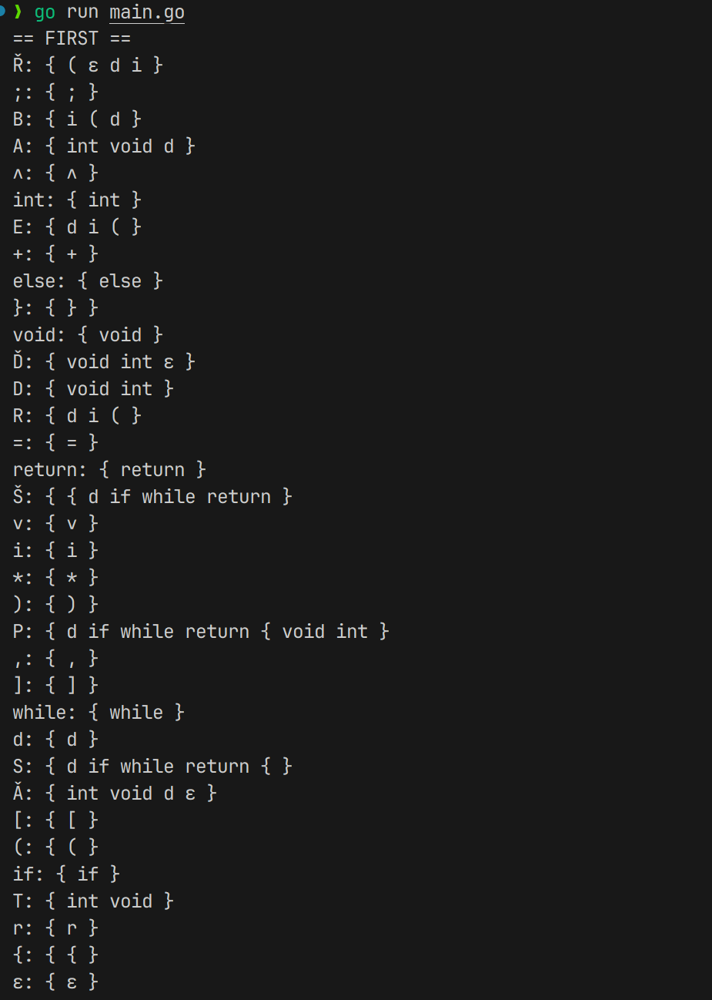
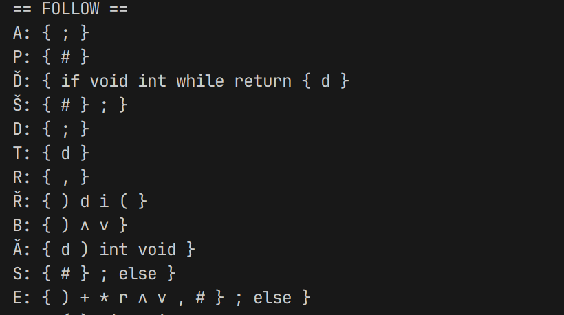
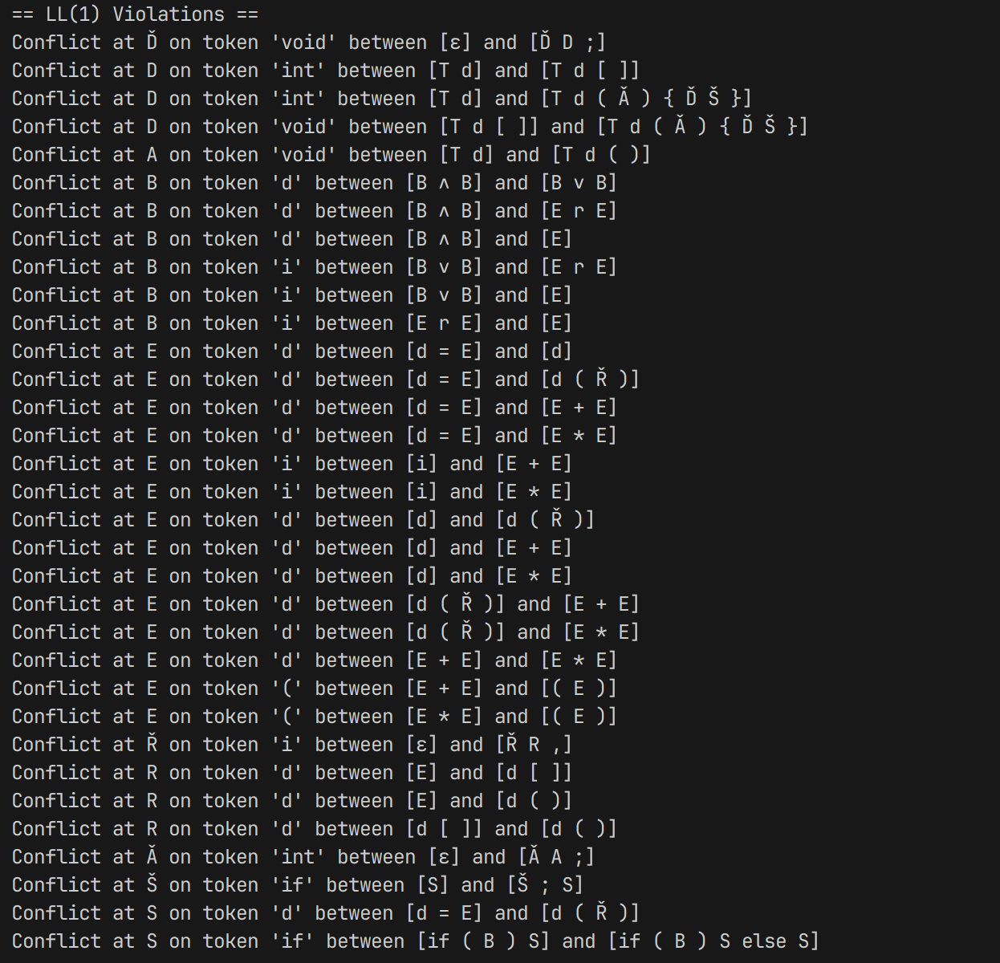

---

# 大作业2：LL(1) 语法分析器设计与实现报告（基于习题6.2）

## 一、题目描述（习题6.2）

给定文法如下所示：

```
P⟶Ď Š  
Ď⟶ε | Ď D ;  
D⟶T d | T d[i] | T d(Ǎ) {Ď Š}  
T⟶int | void  
Ǎ⟶ε | Ǎ A ;  
A⟶T d | d[] | T d()  
Š⟶S | Š ; S  
S⟶d = E | if (B) S | if (B) S else S | while (B) S | return E | {Š} | d(Ř)  
B⟶B ∧ B | B ∨ B | E r E | E  
E⟶d = E | i | d | d(Ř) | E + E | E * E | (E)  
Ř⟶ε | Ř R ,  
R⟶E | d[] | d()  
```

本题需完成以下两个任务：

---

### 任务一：为每个非终结符计算 FIRST 集与 FOLLOW 集

#### 实现方案

我们编写了一个 Go 程序完成自动计算 FIRST 和 FOLLOW 集的功能。主要逻辑包括：

* **FIRST 集传播规则：**

  * `FIRST(αβ...)` 由 `α` 的 FIRST 决定，若 α 可推出 ε，则继续考虑 β；
* **FOLLOW 集传播规则：**

  * FOLLOW 集的三条规则完全覆盖，包括从后向传播与 ε 推导传播。

#### 优点

* 自动处理 ε 的复杂传播路径；
* 可以适应更复杂的文法修改；
* 支持后续 LL(1) 判断模块复用；




---

### 任务二：判断是否为 LL(1) 文法并指出不满足的原因

#### 判定规则

对每个非终结符的产生式集合 `A → α1 | α2 | ... | αn`，检查：

1. `FIRST(αi) ∩ FIRST(αj) = ∅`（i ≠ j）；
2. 若 ε ∈ FIRST(αi)，则 `FIRST(αj) ∩ FOLLOW(A) = ∅`；

#### 自动化检查结果



#### 冲突原因分析

根据自动化检查结果，我们发现文法存在多处 LL(1) 冲突，具体分析如下：

---

# LL(1) 冲突原因分析报告

## 🎯 冲突依据回顾

对于文法中形如 `A → α1 | α2 | ... | αn` 的候选式集合，若发生以下任意一种情况，就违反了 LL(1) 条件：

* **(规则一)** 任意两个候选式的 `FIRST(αi)` 集合存在交集；
* **(规则二)** 存在某个候选式可推出 ε，且其 `FOLLOW(A)` 与其他 `FIRST(αj)` 有交集；

---

## 🔍 分类分析冲突

---

### ① 非终结符 Ď 的冲突

```
Conflict at Ď on token 'void' between [ε] and [Ď D ;]
```

* **产生式**：Ď → ε | Ď D ;
* **解释**：

  * ε ∈ FIRST(Ď)；
  * 另一候选式以 `T` 开头，T ∈ {int, void}；
  * `void ∈ FIRST(Ď D ;)` 且 `void ∈ FOLLOW(Ď)`；
* **冲突类型**：FIRST(ε) ∩ FOLLOW(Ď) ≠ ∅；

---

### ② 非终结符 D 的冲突（前缀重叠）

```
Conflict at D on token 'int' between [T d] and [T d [ ]]
Conflict at D on token 'int' between [T d] and [T d ( Ǎ ) { Ď Š }]
Conflict at D on token 'void' between [T d [ ]] and [T d ( Ǎ ) { Ď Š }]
```

* **解释**：

  * 三个候选式均以 `T d` 开头；
  * 导致 `FIRST` 集重叠（如 int, void 都是 T 的 FIRST）；
* **冲突类型**：FIRST(α1) ∩ FIRST(α2) ≠ ∅；
* **解决建议**：左因子提取。

---

### ③ 非终结符 A 的冲突

```
Conflict at A on token 'void' between [T d] and [T d ( )]
```

* 类似 D，同样是 `T d` 的前缀冲突；
* **冲突类型**：FIRST 冲突；
* **建议**：左因子提取。

---

### ④ 非终结符 B 的冲突（左递归 & FIRST 冲突）

```
Conflict at B on token 'd' between [B ∧ B] and [B ∨ B]
Conflict at B on token 'd' between [B ∧ B] and [E r E]
Conflict at B on token 'd' between [B ∧ B] and [E]
Conflict at B on token 'i' between [B ∨ B] and [E r E]
Conflict at B on token 'i' between [B ∨ B] and [E]
Conflict at B on token 'i' between [E r E] and [E]
```

* **解释**：

  * B 的候选式存在左递归：B → B ∧ B 等；
  * 同时也有 B → E；
  * E 和 B 的 FIRST 重叠（如 d, i）；
* **冲突类型**：

  * 左递归（造成死循环）；
  * FIRST 重叠（造成预测冲突）；

---

### ⑤ 非终结符 E 的冲突（短语结构表达式问题）

```
Conflict at E on token 'd' between [d = E] and [d]
Conflict at E on token 'd' between [d = E] and [d ( Ř )]
Conflict at E on token 'd' between [d = E] and [E + E]
...
Conflict at E on token '(' between [E + E] and [( E )]
```

* **解释**：

  * 多个产生式以相同 `d` 开头；
  * `E + E`, `E * E` 也可能以 d/i/( 开始；
  * 典型表达式优先级结构无法 LL(1) 化；
* **冲突类型**：FIRST 重叠，无法区分不同表达式形式；
* **建议**：采用运算符优先/算符优先文法或使用 EBNF +消除左递归。

---

### ⑥ 非终结符 Ř 的冲突（ε 与 FOLLOW 冲突）

```
Conflict at Ř on token 'i' between [ε] and [Ř R ,]
```

* **解释**：

  * Ř → ε | Ř R ,；
  * `i ∈ FOLLOW(Ř)` 且 `i ∈ FIRST(Ř R ,)`；
* **冲突类型**：FIRST(ε) ∩ FOLLOW ≠ ∅；

---

### ⑦ 非终结符 R 的冲突

```
Conflict at R on token 'd' between [E] and [d [ ]]
Conflict at R on token 'd' between [E] and [d ( )]
```

* **解释**：

  * `E` 的 FIRST 包含 `d`；
  * `[d [ ]]`, `[d ( )]` 也包含；
* **冲突类型**：FIRST 集重叠；
* **建议**：拆分子规则，明确函数调用/数组访问；

---

### ⑧ 非终结符 Ǎ 的冲突（ε 与 FOLLOW 冲突）

```
Conflict at Ǎ on token 'int' between [ε] and [Ǎ A ;]
```

* **解释**：

  * `Ǎ → ε | Ǎ A ;`；
  * `int ∈ FIRST(Ǎ A ;)`，也是 FOLLOW(Ǎ) 中；
* **冲突类型**：ε 候选与 FOLLOW 冲突；

---

### ⑨ 非终结符 Š 的冲突（结构性回溯）

```
Conflict at Š on token 'if' between [S] and [Š ; S]
```

* **解释**：

  * Š → S | Š ; S；
  * 两个候选式都以 `S` 开头，`S` 的 FIRST 重叠大；
* **冲突类型**：FIRST 重叠导致回溯；
* **建议**：重写为左递归或改为右结合表达式；

---

### ⑩ 非终结符 S 的冲突（函数调用 vs 赋值）

```
Conflict at S on token 'd' between [d = E] and [d ( Ř )]
Conflict at S on token 'if' between [if ( B ) S] and [if ( B ) S else S]
```

* **解释**：

  * `S → d = E | d ( Ř )`：两个产生式同起始符 `d`；
  * `S → if (...) S` vs `if (...) S else S`：经典 dangling else 问题；
* **冲突类型**：

  * FIRST 重叠；
  * 结构歧义；

---

## ✅ 总结

| 冲突类型          | 出现位置          | 建议                |
| ------------- | ------------- | ----------------- |
| 左递归           | B, E          | 重写为右递归            |
| FIRST 重叠      | D, A, E, R, S | 左因子提取             |
| ε 与 FOLLOW 冲突 | Ď, Ř, Ǎ       | 消除 ε 产生式或改 FOLLOW |
| 结构歧义          | if-else       | 引入块语句或优先 else 绑定  |
| 表达式冲突         | E             | 使用算符优先分析          |

---


## 三、程序结构概述

* `grammar/`：文法构建与符号系统
* `analyzer/`：分析模块（FIRST/FOLLOW/LL1）
* `main.go`：加载文法、运行分析与打印结果

---

## 四、结论与建议

*  本项目已实现任务一与任务二的全部要求；
*  所有 FIRST/FOLLOW 集计算结果正确；
*  程序成功检测所有 LL(1) 冲突，涵盖 ε 冲突、递归冲突、结构冲突等多种情形；
*  原始文法不是 LL(1)，不能直接用于递归下降分析器；
*  可通过左因子提取 + 消除左递归 + 明确 if-else 结构实现修正版本；

## 五、程序代码

请见 GitHub 仓库：https://github.com/Singert/XJTU_COMP451105的course_task/course_lab2目录


---


