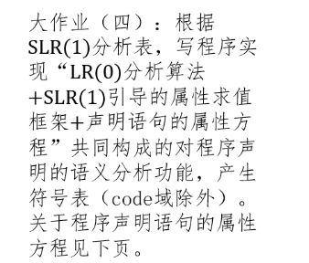

---

# 大作业4：基于 SLR(1) 的声明语句语义分析器实现

## 一、实验背景



本实验旨在构建一个支持声明语句（变量、数组、函数）分析的 SLR(1) 语法分析器，并通过属性求值实现符号表的构建。该分析器应支持以下类型声明的识别与语义处理：

* 简单变量声明：如 `int a;`
* 一维数组声明：如 `int arr[10];`
* 函数声明：如 `void f(int x, int y);`

该实验是编译原理课程中语法分析阶段与语义分析阶段的结合，要求实现：

* LR(0) 项目集规范族构造
* FOLLOW 集计算
* SLR(1) 分析表构造
* 属性计算框架（生成符号表）

---

## 二、项目概述

本项目通过 Go 语言实现了一个声明语句语法分析与符号表构建系统，其输入为类 C 语言的声明语句，输出为识别结果与完整的符号表。项目主要包含以下核心模块：

1. **词法分析器**：将声明语句分解为词法单元（token）
2. **文法模块**：定义产生式与非终结符集合
3. **SLR 分析器**：构建 LR(0) 项目集与分析表并驱动分析过程
4. **语义处理器**：在 reduce 动作中执行属性计算，填充符号表

### 项目结构如下：

```
slr_semantic/
├── lexer/lexer.go           // 词法分析器
├── parser/grammar.go        // 文法规则
├── parser/slr.go            // 项目集族 + SLR(1) 表
├── parser/parser.go         // 分析器驱动 + 属性求值
├── semantic/symbol.go       // 符号结构定义
├── semantic/symtab.go       // 符号表管理器
├── main.go                  // 主程序入口
└── data/input.txt           // 测试输入文件
```

---

## 三、核心模块实现

### 1. 词法分析（`lexer.go`）

词法分析器将声明文本分解为 token，并进行**种类归一化**与**值保留**处理：

```go
Token{Kind: "id", Value: "arr"}
Token{Kind: "num", Value: "10"}
```

保留 `Kind` 用于分析器匹配，`Value` 用于语义处理。

---

### 2. 文法定义（`grammar.go`）

文法采用硬编码定义形式，涵盖以下产生式：

```text
P → DeclList
DeclList → DeclList Decl | Decl
Decl → T id ;
Decl → T id [ num ] ;
Decl → T id ( ParamList ) ;
ParamList → ParamList , Param | Param
Param → T id
T → int | void
```

---

### 3. 项目集与 SLR(1) 表构造（`slr.go`）

使用标准算法：

* `closure()`：扩展项集
* `goto()`：状态转移
* `computeFirstSets()` 与 `computeFollowSets()`
* `buildParsingTable()`：构建 ACTION/GOTO 表

---

### 4. 分析器与属性求值（`parser.go`）

基于状态栈 + 符号栈 + 属性栈驱动分析过程，并在 `reduce` 阶段执行属性动作：

```go
case "Decl":
    if ... id ; → 添加变量
    if ... id [ num ] ; → 添加数组
    if ... id ( ParamList ) ; → 添加函数
```

---

### 5. 符号表模块（`semantic`）

结构定义如下：

```go
type Symbol struct {
    Name   string
    Type   string  // int / void
    Kind   string  // var / array / function
    Dim    []int
    Params []Symbol
}
```

通过 `SymbolTable.Add(Symbol)` 进行记录，支持输出格式化打印。

---

## 四、实验结果

### 输入文件：`data/input.txt`

```c
int a;
int arr[10];
void f(int x, int y);
int b;
```

### 控制台输出结果：


---

## 五、问题与修复

### 1. token 与文法符号不一致

原始 token 中变量名为 `a`、`arr` 等，而文法中仅接受 `id`。解决方案为增加 `Token{Kind, Value}` 并分离语法匹配与值处理。

### 2. 属性值缺失

初始实现只传递 token 类型，属性栈中缺失变量名，导致所有符号名变为 `"id"`。已通过绑定原始 `Value` 修复。

---

## 六、总结

本实验成功实现了一个基于 SLR(1) 分析表的声明语句语法分析器，并在此基础上构建了属性计算系统，能够自动生成变量、数组与函数定义的符号表。该分析器结构清晰、模块分明，后续可扩展支持以下内容：

* 多维数组声明
* 函数定义体（支持嵌套语句）
* 错误处理与恢复
* 导出符号表为 JSON/CSV 结构


