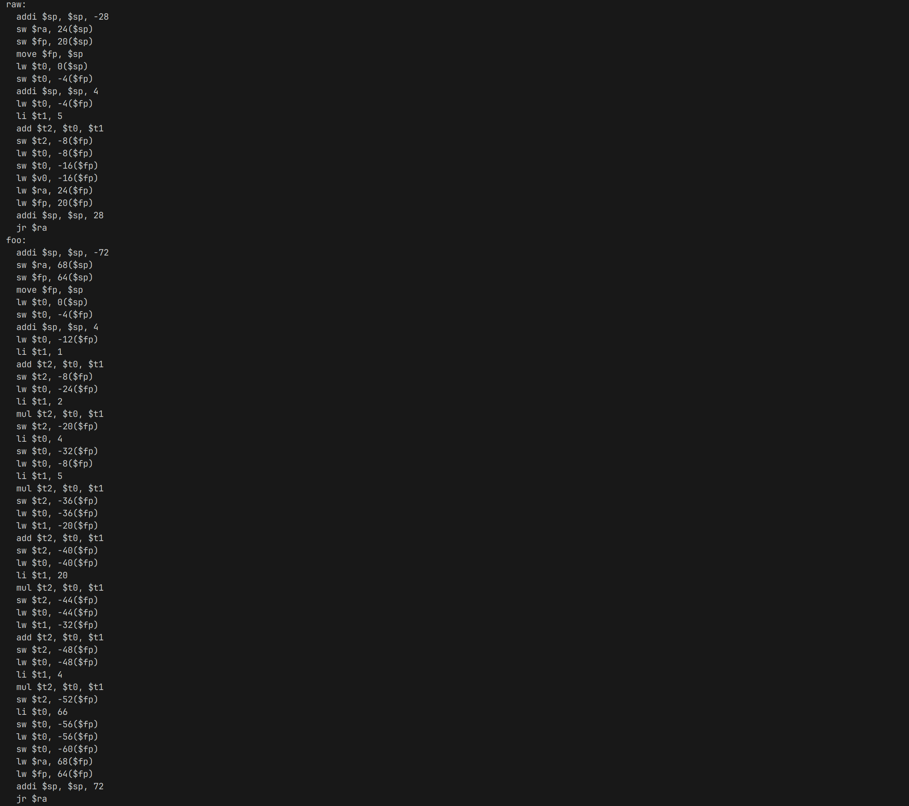
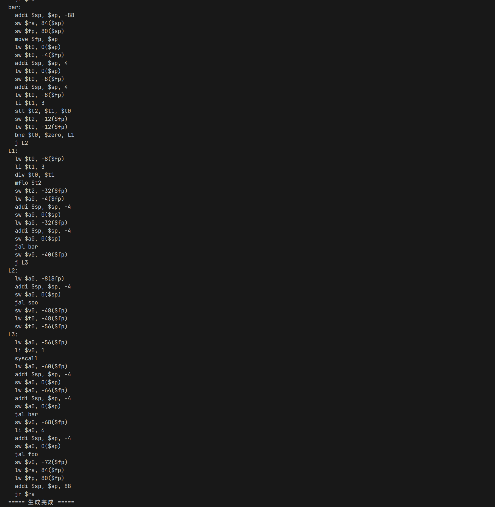

---

# 大作业六：MIPS 汇编代码生成实验报告

## 一、作业背景

本实验是在完成大作业五：三地址代码（TAC）生成器的基础上，进一步将中间代码翻译为 MIPS 汇编代码。MIPS 是一种经典的 RISC 架构，常用于教学目的。本实验目标包括：

* 支持函数定义与调用（含参数传递和返回值）
* 支持表达式运算（加减乘除等）
* 支持条件判断和分支跳转
* 支持嵌套函数与递归调用
* 输出标准 MIPS 汇编代码，便于后续在 MARS 或 QtSPIM 中测试

## 二、项目扩展说明

原始项目已实现词法分析、语法分析和中间代码生成。本作业在此基础上新增 `backend/mips.go`，作为 TAC 到 MIPS 汇编的后端生成模块。

### 修改/新增文件

```
├── backend
│   └── mips.go         // MIPS 汇编生成器（新增）
└── main.go             // 主程序中新增打印 MIPS 功能
```

## 三、关键技术实现

### 1. 函数结构识别与栈帧生成

根据 `LABEL FUNC_foo` 到 `ENDFUNC foo` 的结构，对每个函数构建：

* 保存 `$fp`, `$ra` 到栈上
* 设置新的 `$fp`
* 分配临时变量/参数的栈空间

```asm
addi $sp, $sp, -frame_size
sw $ra, offset($sp)
sw $fp, offset($sp)
move $fp, $sp
```

### 2. 表达式与赋值语句转换

支持四则运算、立即数与变量混合表达式：

```tac
t1 = x + 5
y = t1
```

生成 MIPS：

```asm
lw $t0, offset_x($fp)
li $t1, 5
add $t2, $t0, $t1
sw $t2, offset_t1($fp)
lw $t0, offset_t1($fp)
sw $t0, offset_y($fp)
```

### 3. 函数调用支持

* 逆序压栈参数 `PAR x`
* 使用 `$a0` 将参数传入栈帧
* 使用 `$v0` 返回值

```asm
lw $a0, offset_arg($fp)
addi $sp, $sp, -4
sw $a0, 0($sp)
jal foo
sw $v0, offset_t($fp)
```

### 4. 条件语句翻译

如：

```tac
IF t2 != 0 THEN L1 ELSE L2
```

生成：

```asm
lw $t0, offset_t2($fp)
bne $t0, $zero, L1
j L2
```

### 5. 支持 `z = foo(...)` 形式的返回赋值

通过 `GenerateFunctionCallWithAssign()` 拆分为两条 TAC：

```tac
t5 = CALL foo, 1
z = t5
```

MIPS：

```asm
jal foo
sw $v0, offset_t5($fp)
lw $t0, offset_t5($fp)
sw $t0, offset_z($fp)
```

## 四、实验中解决的问题

### 1. 多余 CALL 嵌套赋值错误

原始错误 TAC：

```tac
z = t5 = CALL foo, 1
```

修复：
将 `CALL` 与赋值拆分为两条指令，并在 `GenerateFunctionCallWithAssign()` 中提取临时变量 `t5` 作为赋值源。

### 2. 函数标签处理不规范

防止 `jal foo,` 语法错误，清理多余的逗号。

### 3. 标签 `THEN` / `ELSE` 未替换为实际 `Lx`

已统一将 `IF` 语句翻译为 `bne` 和 `j Lx` 样式。

### 4. 函数出口重复生成 RETURN 指令

通过扫描 `RETURN` 语句是否存在，避免自动附加函数退出代码两次。

## 五、实验结果

以以下源程序为例：

```c
int raw(int x) {
    y = x + 5;
    return y;
}

void foo(int y) {
    int z;
    void bar(int x, int soo()) {
        if (x > 3)
            bar(x / 3, soo);
        else
            z = soo(x);
        print z;
    }
    bar(y, raw);
}

foo(6);
```

生成的三地址代码：

```tac
LABEL FUNC_raw
POP x
t1 = x + 5
y = t1
RETURN y
ENDFUNC raw
LABEL FUNC_foo
POP y
LABEL FUNC_bar
POP soo
POP x
t2 = x > 3
IF t2 != 0 THEN L1 ELSE L2
LABEL L1
t3 = x / 3
PAR soo
PAR t3
t4 = CALL bar, 2
GOTO L3
LABEL L2
PAR x
t5 = CALL soo, 1
z = t5
LABEL L3
PRINT z
ENDFUNC bar
PAR raw
PAR y
t6 = CALL bar, 2
ENDFUNC foo
PAR 6
t7 = CALL foo, 1
```

对应的 MIPS 汇编结果



## 六、总结

本实验成功实现了从三地址代码到 MIPS 汇编的完整代码生成流程。实现了函数调用、参数传递、条件判断、返回赋值等复杂结构的 MIPS 映射。通过精细控制寄存器与栈帧，我们生成的汇编可在 MARS/QtSPIM 中直接运行。

未来可以扩展支持：

* 数组访问与多维偏移
* 全局变量与数据段管理
* 更复杂的表达式短路求值（`&&`, `||`）

---


