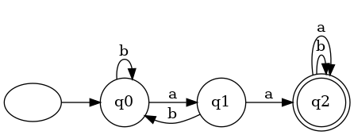
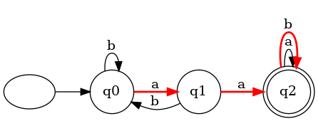
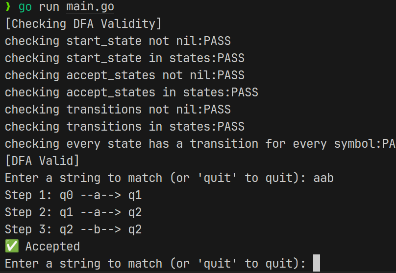
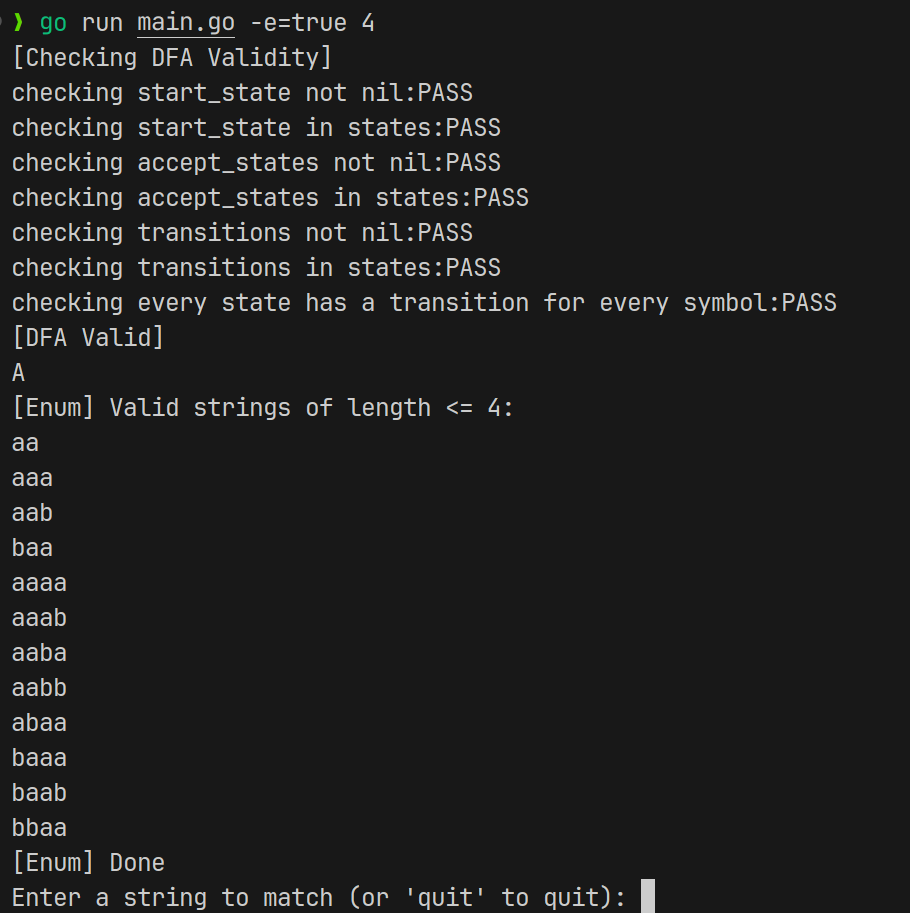

---


## ✅ 实验一报告：DFA模拟与可视化

### 一、实验目的

* 掌握确定有限自动机（DFA）的五元组表示法；
* 实现一个 DFA 模拟器，支持状态转移、合法性检查、字符串匹配与可视化；
* 构造一个用于识别特定语言的 DFA，验证其识别能力；
* 以图形方式展示 DFA 的结构和匹配路径，提升对自动机运行机制的理解。

---

### 二、实验内容与要求

本实验要求实现：

1. **DFA 数据结构**与 JSON 配置加载；
2. **DFA 合法性检查**，包括起始状态、接受状态、转移完备性等；
3. **字符串匹配功能**，并记录状态转移路径；
4. **枚举所有长度 ≤ N 的可接受字符串**；
5. **将 DFA 和匹配路径导出为 Graphviz `.dot` 图**，并可渲染为图像。

---

### 三、DFA 设计与实现

#### 3.1 五元组定义

DFA 为五元组 $M = (Q, \Sigma, \delta, q_0, F)$，本实验中：

* `Q = {q0, q1, q2}`：状态集合；
* `Σ = {a, b}`：输入符号集合；
* `q0`：起始状态；
* `F = {q2}`：接受状态集合；
* `δ`：状态转移函数，如：

| 当前状态 | 输入 | 下一状态 |
| ---- | -- | ---- |
| q0   | a  | q1   |
| q0   | b  | q0   |
| q1   | a  | q2   |
| q1   | b  | q0   |
| q2   | a  | q2   |
| q2   | b  | q2   |

#### 3.2 JSON DFA 配置示例

文件 `./json/dfa.json`：

```json
{
    "alphabet": ["a", "b"],
    "states": ["q0", "q1", "q2"],
    "start_state": "q0",
    "accept_states": ["q2"],
    "transitions": {
        "q0": {"a": "q1", "b": "q0"},
        "q1": {"a": "q2", "b": "q0"},
        "q2": {"a": "q2", "b": "q2"}
    }
}
```

---

### 四、核心功能说明

#### 4.1 DFA 加载与合法性检查

调用 `LoadDFAFromJson()`，进行如下检查：

* 起始状态存在且 ∈ 状态集；
* 所有接受状态 ∈ 状态集；
* 所有状态的转移在字母表中定义；
* 每个状态对每个符号都有转移（完备性）；
* 输出结构图 `dfa.dot`。

#### 4.2 字符串识别与路径记录

输入字符串后调用 `MatchDFA()`：

* 逐字符状态转移；
* 打印每步路径；
* 匹配成功则导出匹配路径高亮 `.dot` 文件，如：`aab.dot`。

#### 4.3 有限长度枚举

调用 `EnumValidStrings(N)`：

* 使用 BFS 从空串出发；
* 每次扩展当前字符串 + `a` 或 `b`；
* 若在接受状态中，加入结果。

#### 4.4 可视化图导出

使用 `ExportDFAtoDot()` 和 `ExportToDot()`：

* 生成原始结构图 `dfa.dot`；
* 根据匹配路径标红，生成 `输入.dot`；
* 使用 `dot -Tpng aab.dot -o aab.png` 生成图像。

---

### 五、实验效果截图

* `dfa.png`：DFA 结构图
 
* `aab.png`：匹配路径图（红色边）
 
* 命令行输出匹配路径
 
* 有效字符串枚举结果输出（如 `aab`, `aa`, `aaa`）
 

---

### 六、实验总结

* 理解了 DFA 的五元组构成；
* 熟练掌握了状态机模拟、状态转移图构建与自动化测试；
* 学会了用 `.dot` 可视化抽象结构，增强 DFA 运行直观性；
* 建立了基础 DFA 包，为后续词法分析器（scanner）实验二打下基础。


