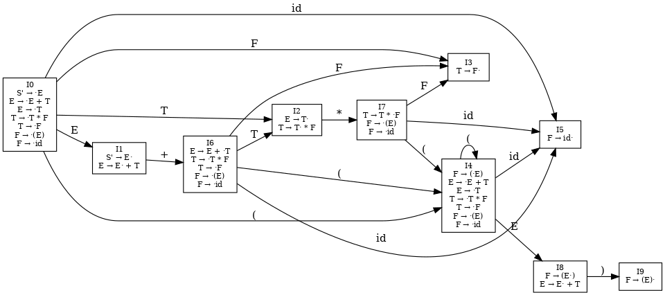

根据你上传的第八章 PDF（《第八章 自下而上的语法分析》）以及实验三的 PPT 内容，可以看出：

---

## ✅ 实验三的核心任务（来自 PPT）

实验三的目标是：

> **构建给定文法的 LR(0) 项目集规范族（Canonical Collection of LR(0) Items）**，为后续实验四的 SLR(1) 分析表生成提供基础。

具体包含：

1. **输入：文法规则**（支持扩展 BNF，如 `E → E + T | T`）
2. **任务输出：**

   * 增广文法（添加 `S' → S` 形式）
   * 初始项目集 `I₀`（形如 `S' → ·S`）
   * 所有状态的 **闭包（Closure）** 和 **转移（Goto）**
   * 输出所有项目集（含内核项 Kernel Items）
   * 构建 **项目集规范族图**

---

## 🧠 实验三与第八章内容的知识对照

| 实验三内容           | 第八章讲解内容（支持）                                     |
| --------------- | ----------------------------------------------- |
| 构造 LR(0) 项目集规范族 | 第八章讲解了 **LR(0) 分析原理**、**item 集合构造算法**           |
| 构造文法项目（items）   | 定义了 **项目：A → α · β**，用于表示文法中某一归约状态              |
| 构建项目集 I₀、I₁…    | 第八章详细阐述了 **闭包(closure)** 和 **转移(goto)** 的计算方法   |
| 图形化展示项目集规范族     | 第八章也介绍了如何将 item DFA 作为 **LR(0) 分析器的状态图表示**      |
| 判断是否存在冲突        | 第八章讲明了 **LR(0)** 和 **SLR(1)** 处理冲突的方式（如移进-归约冲突） |

---

## 🔧 实验实现建议（结合课程知识）

根据教材第八章，你可以这样组织实验三：

### 1. 增广文法构造

添加新的起始产生式 `S' → S`，确保 LR 分析以 `S'` 为唯一接受状态。

### 2. 文法项目集生成

对于每条产生式 `A → αβ`，生成项目集合 `A → α · β`，表示分析位置。

### 3. 计算闭包与转移

* **Closure(I)**：如果某项目 `A → α · Bβ` 中的 `·` 后是非终结符 `B`，需添加所有 `B → ·γ`。
* **Goto(I, X)**：构造一个新项目集，表示状态 `I` 对符号 `X` 的转移。

### 4. 项目集规范族构造

不断进行闭包与转移，直到无法生成新的状态集合。

### 5. 输出结果

* 所有 item 集合及其内核（Kernel）
* 每个状态及其转移边
* 可以使用图形工具（如 Graphviz）生成项目集状态图

---

## 📝 实验报告内容建议

你应在实验报告中详细说明以下几个方面：

### 实验目的

构建 LR(0) 项目集规范族，为后续生成 SLR 分析表打基础。

### 理论依据

* LR 分析基本原理（第八章）
* 项目集、闭包、转移函数的定义与算法

### 实现细节

* 如何构建增广文法
* 如何生成和标号项目集（I₀, I₁, …）
* 如何用程序或图示表示 DFA 状态之间的转移

### 实验示例

* 给定文法规则
* 输出所有项目集及其编号
* 输出状态转移图（可视化）

### 实验收获与不足

* 对“自下而上语法分析”过程的深入理解
* 对冲突（如移进-归约冲突）的认识

---

好的，我们从最基础的概念开始解释：

---
# 一 、文法
## （一）文法与文法规则
### 📘 1、什么是“文法”（Grammar）

**形式文法（Formal Grammar）** 是形式语言理论的核心概念，用于描述一种语言中所有合法字符串的生成方式。

#### ✅ 一个文法由四元组表示：

$$
G = (V, T, P, S)
$$

其中：

| 符号  | 含义                                                                |
| --- | ----------------------------------------------------------------- |
| $V$ | 变量（变元 / 非终结符）：可以继续被替换的符号，例如 `E`, `T`, `F`                         |
| $T$ | 终结符（terminal symbols）：最终出现在语言字符串中的基本字符，如 `+`, `*`, `id`, `(`, `)` |
| $P$ | 产生式规则（Production rules）：形如 `A → α`，表示非终结符 `A` 可替换为串 `α`           |
| $S$ | 开始符号（Start symbol）：推导的起点，必须是 $V$ 中的某个符号                           |


### 📘 2、什么是“文法规则”（Production Rules）

**文法规则** 就是上述四元组中的 $P$，用于定义如何从非终结符生成其他符号。

#### ✅ 一条文法规则的基本形式：

$$
A \rightarrow \alpha
$$

* $A \in V$：左部是一个非终结符
* $\alpha \in (V \cup T)^*$：右部是由终结符和非终结符构成的串（可以为空）

#### 🔍 举个例子：

设有文法：

```
E → E + T
E → T
T → T * F
T → F
F → (E)
F → id
```

这是一个典型的**算术表达式文法**，表示合法的表达式可以由加法、乘法、小括号和标识符 `id` 组成。


### 📎 小结

| 项目       | 示例                       | 解释                |
| -------- | ------------------------ | ----------------- |
| 非终结符 $V$ | E, T, F                  | 表达式、项、因子等抽象结构     |
| 终结符 $T$  | `+`, `*`, `id`, `(`, `)` | 最终代码中直接出现的基本单位    |
| 规则 $P$   | E → E + T                | 非终结符如何展开成子结构      |
| 起始符号 $S$ | E                        | 整个程序从表达式 `E` 开始构造 |

---
## （二）**四则运算表达式**经典文法

```
E → E + T
E → T
T → T * F
T → F
F → (E)
F → id
```


### ✅ 1、从整体上看：这是一个形式文法（CFG）

它的形式是 $G = (V, T, P, S)$，其中：

* $V = \{E, T, F\}$：非终结符（变量）
* $T = \{+, *, (, ), \text{id} \}$：终结符
* $P$：产生式集合（如下列规则）
* $S = E$：开始符号


### ✅ 2、逐条解释每一条文法规则

我们从最下层的定义 F 开始，逐步向上构建表达式。


#### 🔹 规则：`F → id`

> 含义：一个因子（F）可以是一个“标识符”。

* `id` 表示变量、数字、常量，例如 `x`, `y`, `42`
* 所以 `F` 是语法中的“基本单位”


#### 🔹 规则：`F → (E)`

> 含义：一个因子（F）也可以是一个括号括起来的表达式（E）

* 例如：`(x + y)` 是一个因子
* 括号优先级高，可以嵌套表达式


#### 🔹 规则：`T → F`

> 含义：一个项（T）可以是一个因子（F）

* `T` 是乘法项，构建“乘法链”的基础


#### 🔹 规则：`T → T * F`

> 含义：一个项（T）也可以是另一个项 `T` 乘以一个因子 `F`

* 例如：`x * y * z` 会被解析为 `T → T * F → T * F * F`，左结合
* 递归地定义乘法操作优先级比加法高


#### 🔹 规则：`E → T`

> 含义：一个表达式（E）可以是一个项（T）

* 就是说，一个表达式可以没有加号，直接是一个乘法表达式或一个变量等


#### 🔹 规则：`E → E + T`

> 含义：一个表达式（E）也可以是另一个表达式加上一个项（T）

* 例如：`a + b + c` 会被解析为 `E → E + T → E + T + T`
* 递归地定义加法表达式，左结合


### ✅ 3、一个完整的例子

我们用这组规则生成一个表达式：

```
x + y * (z + 1)
```

推导过程如下：

1. `E`
2. `→ E + T`
3. `→ T + T`（由 `E → T`）
4. `→ F + T`（由 `T → F`）
5. `→ id + T`（假设 `x` 是 id）
6. `→ id + T * F`（由 `T → T * F`）
7. `→ id + F * F`（`T → F`，`F → (E)`）
8. `→ id + id * (E)`
9. `→ id + id * (E + T)`
10. `→ id + id * (id + id)`（进一步展开 `E → T → F → id`）

最后生成：

```
id + id * (id + id)
```

也就是：

```
x + y * (z + 1)
```


### ✅ 4、非终结符的语义层级（体现优先级）

| 非终结符 | 对应结构      | 优先级 |
| ---- | --------- | --- |
| `E`  | 表达式：加法层   | 最低  |
| `T`  | 项：乘法层     | 中间  |
| `F`  | 因子（括号、变量） | 最高  |

所以这个文法还自然地**反映了运算符的优先级与结合性**：

* `*` 优先于 `+`
* 结合性是左结合（因为左递归）

---

### ✅ 5、解释：左递归


####  （1）什么是“左递归”？

在形式文法中，如果一个非终结符 $A$ 的某条产生式右部的**开头仍是 $A$**，则称该规则是**左递归**的。

##### 形式定义：

$$
A \rightarrow A\alpha
$$

其中 $\alpha$ 是任意非空串。


####  （2）T → T \* F 是左递归吗？

我们来看这条规则：

$$
T \rightarrow T * F
$$

右部的第一个符号是 `T`（与左部相同），符合定义：

* 非终结符 `T` 出现在自己的右部开头 ⟹ **左递归** ✅


#### （3）为什么用左递归来表示运算？

左递归的设计有一个重要作用：

> **自然表达左结合的运算顺序**。

##### 举个例子：

表达式：

```
a * b * c
```

文法：

```
T → T * F
T → F
```

归约过程（从最右推导逆过程看）：

```
a * b * c
→ T * c        （a * b → T）
→ T            （T * c → T）
```

语法树结构会变成：

```
     T
   / | \
  T  *  F
 /|\     |
F * F    c
 |   |
 a   b
```

这表示：

```
(a * b) * c
```

也就是说：**左递归 = 左结合**


#### （4）左递归 vs 右递归（对比）

| 类型  | 示例规则        | 表达式结构         | 对应结合性        |
| --- | ----------- | ------------- | ------------ |
| 左递归 | `T → T * F` | `(a * b) * c` | 左结合（如加法、乘法）  |
| 右递归 | `T → F * T` | `a * (b * c)` | 右结合（如赋值、幂运算） |


#### （5）编译器设计中左递归的作用

* **自下而上的语法分析**（如 LR 分析）：喜欢左递归结构 ✅
* **自上而下的语法分析**（如 LL(1)）：不允许左递归 ❌，要先消除

所以：

* **你现在做的实验三（LR 分析）是基于左递归没问题**
* 如果是 LL(1)，则要改写为右递归或消除左递归（如引入辅助规则）


#### （6） 小结

| 问题                    | 回答                    |
| --------------------- | --------------------- |
| 什么是左递归？               | 非终结符在产生式右部开头重复自己      |
| 为什么 `T → T * F` 是左递归？ | 因为右部以 `T` 开头，和左边一样    |
| 它有什么用？                | 表示左结合运算，如加法、乘法        |
| 在实验中安全吗？              | 对于 LR 分析（实验三）来说是完全可以的 |

---

## （三） 增广文法

### ✅ 1、什么是“增广文法”（Augmented Grammar）

**增广文法**是对原文法的一个**技术性扩展**，用于配合语法分析器（尤其是 LR 系列）正确识别输入是否完全匹配整套规则。


### ✅ 2、为什么需要“增广”？

在 LR(0)、SLR(1) 等自下而上的语法分析中：

* 我们的目标是识别“**整个输入串是一个合法句子**”。
* 为此，我们需要明确一个唯一的“接受状态”来判断“归约成功”。

但是普通文法如：

```
E → E + T | T
T → T * F | F
F → (E) | id
```

并没有一个规则表示“分析到哪就结束”。


### ✅ 3、怎么“增广”？

给原文法添加一个新的起始符号 $S'$，并加上一条规则：

$$
S' \rightarrow S
$$

其中：

* $S'$ 是新增的起始符号（不在原来文法中）
* $S$ 是原来的起始符号（比如 `E`）


#### 🔍 示例：对原文法增广

原文法：

```
E → E + T | T
T → T * F | F
F → (E) | id
```

增广后：

```
E' → E       ← 新增
E  → E + T
E  → T
T  → T * F
T  → F
F  → (E)
F  → id
```

这里：

* `E'` 是新增的“总起始符号”，表示整个程序的入口；
* 当分析器将整个输入归约为 `E'` 时，就表示“分析完成” ✅


### ✅ 4、增广文法的作用

| 用途                   | 说明                                                             |
| -------------------- | -------------------------------------------------------------- |
| 指定唯一接受状态             | 有了 `S' → S`，只有当整个输入归约为 `S` 时，才能进一步归约为 `S'`，这就能 **准确判断输入已全部匹配** |
| 支持构建 item 项集         | 初始项目集就是从 `S' → ·S` 开始的                                         |
| 支持生成分析表（ACTION/GOTO） | `S' → S·` 是唯一表示“接受”的完整项目                                       |
| 提高规范性和一致性            | 分析器统一从 `S' → ·S` 开始，避免原始文法结构混乱                                 |


### ✅ 5、图示理解

归约过程最后一步：

```
Z0 E · #         ← 最后一步归约
→ Z0 E' · #      ← 表示分析成功（acc）
```

如果没有 `E' → E`，分析器**无法知道何时结束**。


### ✅ 6、总结

| 问题       | 回答                                 |
| -------- | ---------------------------------- |
| 什么是增广文法？ | 在原文法基础上新增起始符号 `S'` 和规则 `S' → S`    |
| 为什么要增广？  | 为了构建语法分析器的接受状态（唯一识别整个输入已被匹配）       |
| 有什么用？    | 能构建 `I₀` 初始项目集，唯一识别 `acc` 状态，生成分析表 |
| 会改变语言吗？  | 不会，`S'` 只是辅助项，识别完成仍然基于原来的语言        |

---

## （四） 实验三文法：扩展巴科斯范式：


### ✅ 给定文法（扩展巴科斯范式）

```
S' → E              ← 增广产生式（新增）
E  → E + T | T
T  → T * F | F
F  → (E) | id
```

这是一个**经典表达式文法**，用于描述带括号、加法、乘法、变量（id）的算术表达式。


### ✅ 非终结符集合（V）

```
{S', E, T, F}
```


### ✅ 终结符集合（T）

```
{+, *, (, ), id}
```


### ✅ 各产生式展开如下：

```
(1) S' → E

(2) E → E + T
(3) E → T

(4) T → T * F
(5) T → F

(6) F → (E)
(7) F → id
```

这些产生式将用于构建实验三的 **LR(0) 项目集规范族**，即：

* 构建项目（如 `E → E · + T`）
* 构建闭包（Closure）
* 构建转移（Goto）
* 构建规范族（item DFA）

---


# 二 项目和项目集

很好，现在我们进入实验三的核心概念：

---

## ✅ （一）、什么是“项目（Item）”？

在 LR(0) 分析中，一个\*\*项目（item）\*\*是某条产生式的“分析进度”，用一个“·”符号（圆点）来表示我们当前分析到哪。


### ✅ 项目的形式：

$$
A \rightarrow \alpha \cdot \beta
$$

含义是：

* `A → αβ` 是一条产生式；
* `·` 表示分析器当前已经识别出 `α`，下一步将尝试识别 `β`。
  


### 🔍 例子：

产生式：

```
E → E + T
```

可能的项目有：

| 项目            | 意义                  |
| ------------- | ------------------- |
| `E → · E + T` | 什么都没分析，还在起点         |
| `E → E · + T` | 已分析出 `E`，接下来是 `+`   |
| `E → E + · T` | 已分析出 `E +`，接下来是 `T` |
| `E → E + T ·` | 整个右部分析完成，准备归约       |


## ✅ （二）、什么是“项目集（Item Set）”？

一个**项目集**就是若干个项目组成的集合，表示语法分析器在某个状态下，可能处于的多个分析进度。

* 每一个**状态**就是一个项目集
* 整个 LR(0) 分析的核心是构造**项目集之间的状态转移图**


### ✅ 为什么用“集合”而不是“单个项目”？

因为：

* 某个状态下，可能有多个产生式正在分析（同时候选）
* 项目集捕捉了所有这些“可能”的分析路径


### 🔍 例子：初始项目集 I₀

设文法增广为：

```
S' → E
E → E + T | T
T → T * F | F
F → (E) | id
```

那么 `I₀` 是以增广项目 `S' → ·E` 为核心的闭包，包含如下项目集：

```
I₀ = {
  S' → ·E
  E  → ·E + T
  E  → ·T
  T  → ·T * F
  T  → ·F
  F  → ·(E)
  F  → ·id
}
```

这些项目是通过“**闭包运算（Closure）**”得到的，我们稍后解释。


## ✅ （三）、项目和状态的关系

| 概念              | 对应                      |
| --------------- | ----------------------- |
| 一个项目（A → α · β） | 当前某条产生式的分析位置            |
| 一个项目集           | 一个分析状态                  |
| 项目集之间的转移        | 分析器在读入符号后进入新的状态         |
| 整个项目集集合         | 就是 LR(0) 的状态图（item DFA） |


## ✅ （四）、总结

| 项             | 项集        | 状态         |
| ------------- | --------- | ---------- |
| `E → E + · T` | 多个这样的项合起来 | 构成一个 LR 状态 |
| 项目描述分析位置      | 项目集描述当前状态 | 项目集之间可以跳转  |


---

#  三、闭包

## ✅ （一）、什么是闭包运算（Closure）？

**闭包（closure）运算**是：

> 给定一个项目集合，从中**递归地推导出所有可能立即需要分析的项目**，形成“闭包状态”。

### 通俗理解：

如果某个项目的“点后面”是一个非终结符 `B`，那你就要考虑 `B` 所有可能的展开（产生式），并把这些也加进来（作为新的项目）！


## ✅ （二）、闭包的正式定义

给定一个项目集 $I$，**Closure(I)** 是包含 $I$ 中所有项目，**并且满足以下条件的最小集合**：

* 如果某个项目 $A \rightarrow \alpha \cdot B \beta \in I$ 且 `B` 是非终结符，
* 那么将 `B` 所有产生式 `B → γ` 变成项目 `B → · γ` 加入到 I，
* 并继续对新加入的项目递归应用这个过程。


## ✅ （三）、一步一步的例子

假设文法如下：

```
S' → E
E → E + T | T
T → T * F | F
F → (E) | id
```

我们先构建初始项目集：

```
I₀ = closure({S' → ·E})
```


### 第一步：

包含 `S' → ·E`

发现点后是 `E`，于是查找 `E` 的所有产生式：

```
E → E + T
E → T
```

将它们转为项目（点在最前）：

```
E → · E + T
E → · T
```


### 第二步：

现在项目集是：

```
S' → · E
E  → · E + T
E  → · T
```

继续看：点后是 `E` 或 `T`，都是非终结符。

继续展开 `T` 的产生式：

```
T → T * F
T → F
```

变成项目：

```
T → · T * F
T → · F
```


### 第三步：

继续看 `F` 的产生式：

```
F → (E)
F → id
```

变成项目：

```
F → · (E)
F → · id
```


### 最终闭包结果（I₀）：

```
S' → · E
E  → · E + T
E  → · T
T  → · T * F
T  → · F
F  → · (E)
F  → · id
```

✅ 这个就是项目集 `I₀`，代表“分析器刚开始的状态”。


## ✅ （四）、闭包图示总结（关系图）

从 `S' → · E` 出发，按点后符号依次扩展：

```
S' → ·E
        ↓（点后是 E）
   E → ·E + T
   E → ·T
           ↓（点后是 T）
      T → ·T * F
      T → ·F
              ↓（点后是 F）
         F → ·(E)
         F → ·id
```

这是一个典型的**递归构建过程**，直到点后再也没有非终结符。


## ✅ （五）、闭包的作用总结

| 问题             | 答案                         |
| -------------- | -------------------------- |
| 为什么做闭包？        | 分析器准备处理“非终结符”时，必须知道它所有可能展开 |
| 点后不是非终结符还要扩展吗？ | 不需要，只扩展非终结符                |
| 闭包操作何时停止？      | 当没有新的项目能加入时（点后没有新非终结符）     |


## ✅ （六）、和实验三的关系

在实验三中：

* 每一个项目集状态的构建都依赖于**闭包运算**
* 初始状态就是 `closure({S' → ·S})`
* 每一次 GOTO 之后也要对结果执行 closure 才能形成新状态

---

# 四、 **GOTO 函数** 


## ✅ （一）、什么是 GOTO 函数？

GOTO 是一个状态间的**转移函数**，定义为：

$$
\text{GOTO}(I, X) = \text{closure}(\{A \rightarrow \alpha X \cdot \beta \mid A \rightarrow \alpha \cdot X \beta \in I\})
$$

即：

> 从项目集 $I$ 中找出点在符号 $X$ 前的项目，把点“移过” $X$，然后对得到的新项目集做闭包。


## ✅ （二）、作用：描述状态之间的跳转

GOTO 的本质：

* 输入一个状态（项目集）和一个符号 $X$
* 输出：读入 $X$ 后应该跳转到的“下一状态”（新的项目集）


## ✅ （三）、手动例子（继续使用上节构造好的 I₀）

复习我们刚才得到的：

```
I₀ =
S' → · E
E  → · E + T
E  → · T
T  → · T * F
T  → · F
F  → · (E)
F  → · id
```

---

### 🔍 举例：计算 GOTO(I₀, E)

找出 I₀ 中所有项目形如：

```
A → α · E β
```

即点在 `E` 前面的项目：

* `S' → · E`
* `E  → · E + T`

将点移过 `E`：

* `S' → E ·`
* `E  → E · + T`

这就是“核心项集”，再做闭包：

* 点后是 `+`（终结符） ⇒ 不扩展

所以：

```
GOTO(I₀, E) =
{
  S' → E ·
  E  → E · + T
}
```

这就是一个新项目集（可标号为 I₁）


### 再举例：GOTO(I₀, T)

找到：

* `E → · T` → `E → T ·`
* `T → · T * F` → `T → T · * F`

所以 GOTO(I₀, T) 包括：

* `E → T ·`
* `T → T · * F`

点后是 `*`（终结符） ⇒ 不再扩展

```
GOTO(I₀, T) =
{
  E → T ·
  T → T · * F
}
```

新状态：I₂


## ✅ （四）、GOTO 和状态图的关系

你可以这样理解整个分析器的“状态转移图”：

* 每个状态是一个项目集（closure 后的集合）
* 有边连接它们：

  * 边的标记是符号 X
  * 从 I 到 GOTO(I, X)

这构成了所谓的 **项目集规范族 DFA**（item DFA）


## ✅ （五）、GOTO 总结

| 步骤                     | 说明            |
| ---------------------- | ------------- |
| 1️⃣ 从项目集 I 中找到点前是 X 的项 | `A → α · X β` |
| 2️⃣ 移动点                | `A → α X · β` |
| 3️⃣ 对这些新项构建 closure    | 得到新的项目集（状态）   |
| 4️⃣ 这是从 I 读入 X 后跳到的新状态 | `GOTO(I, X)`  |


## ✅ （六）、实验三的整体状态构建流程

1. 从 `closure({S' → · S})` 作为起始状态 I₀
2. 对 I₀ 所有点后符号 $X$ 执行 GOTO ⇒ 得到新状态
3. 对每个新状态重复此过程（直到不能再得到新状态）
4. 最终构成整个状态图（项目集规范族）

---


# LR(0)项目状态集

非常好，继续深入！

---

## ✅ 什么是 ACTION / GOTO 表？

`ACTION` 和 `GOTO` 表是 **LR(0) 语法分析器**的核心控制表，用于驱动整个分析过程。

---

### 🔷 它们是干什么的？

* `ACTION`: 决定当前状态遇到一个**终结符**时该做什么（移进、归约、接受或错误）
* `GOTO`: 决定当前状态归约出一个**非终结符**后转到哪个状态

---

## ✅ 表的结构

| 状态  | `id` | `+` | `*` | `(` | `)` | `#` | `E` | `T` | `F` |
| --- | ---- | --- | --- | --- | --- | --- | --- | --- | --- |
| 0   | s5   |     |     | s4  |     |     | 1   | 2   | 3   |
| 1   |      | s6  |     |     |     | acc |     |     |     |
| 2   |      | r3  | s7  |     | r3  | r3  |     |     |     |
| ... |      |     |     |     |     |     |     |     |     |

其中：

* `sN`：shift，移进并转到状态 N
* `rK`：reduce，按照第 K 条产生式归约
* `acc`：接受（分析成功）
* 空：错误（非法输入）
* 数字：表示 `GOTO` 转移目标状态

---

## ✅ 如何构建 ACTION / GOTO 表？

### 1. 使用 LR(0) 项目集规范族（我们刚刚画的状态图）

对于每个状态：

#### 🔹 如果某项形如 `A → α · a β` 且 `a` 是终结符：

* 就表示可以“移进” `a`，写 `ACTION[state, a] = sX`（X 是 GOTO 转移后状态）

#### 🔹 如果某项形如 `A → α ·`（点在末尾）：

* 就表示可以归约，写 `ACTION[state, a] = rK`，对所有终结符 `a`（**LR(0)** 不看具体 `a`，所以可能冲突）
* 如果是 `S' → S ·`，则 `ACTION[state, #] = acc`

#### 🔹 如果 GOTO(state, A) = X，A 是非终结符：

* 则 `GOTO[state, A] = X`

---

## ✅ 例子

对于增广文法：

```
(0) S' → E
(1) E → E + T
(2) E → T
(3) T → T * F
(4) T → F
(5) F → (E)
(6) F → id
```

若你有状态：

```
I2:
E → T·
T → T· * F
```

说明：

* `T → T· * F` 后有 `*` ⇒ `ACTION[2, *] = s7`
* `E → T·` 是完整项目 ⇒ `ACTION[2, (所有终结符)] = r2`（使用规则 2：`E → T`）

---

## ✅ LR(0) 分析器运行过程

分析器用两个栈：

1. 状态栈（数字）
2. 符号栈（终结符/非终结符）

每次查看 `ACTION[当前状态, 当前输入符号]`：

* 若是 `sN`：移进当前符号并转入状态 N
* 若是 `rK`：弹出产生式右部长度，推入产生式左部，用 `GOTO` 查状态
* 若是 `acc`：分析成功
* 若无动作：语法错误

---

## ✅ 总结

| 表名       | 输入   | 控制行为         | 内容                               |
| -------- | ---- | ------------ | -------------------------------- |
| `ACTION` | 终结符  | 移进 / 归约 / 接受 | shift (`sN`), reduce (`rK`), acc |
| `GOTO`   | 非终结符 | 状态跳转         | 下一个状态编号                          |

---

|   | id | +  | *  | (  | )  | #   | E | T | F |
|---|----|----|----|----|----|-----|---|---|---|
| 0 | s5 |    |    | s4 |    |     | 1 | 2 | 3 |
| 1 |    | s6 |    |    |    | acc |   |   |   |
| 2 |    | r2 | s7 |    | r2 | r2  |   |   |   |
| 3 |    | r4 | r4 |    | r4 | r4  |   |   |   |
| 4 | s5 |    |    | s4 |    |     | 8 | 2 | 3 |
| 5 |    | r6 | r6 |    | r6 | r6  |   |   |   |
| 6 | s5 |    |    | s4 |    |     |   | 2 | 3 |
| 7 | s5 |    |    | s4 |    |     |   |   | 3 |
| 8 |    | s6 |    |    | s9 |     |   |   |   |
| 9 |    | r5 | r5 |    | r5 | r5  |   |   |   |
