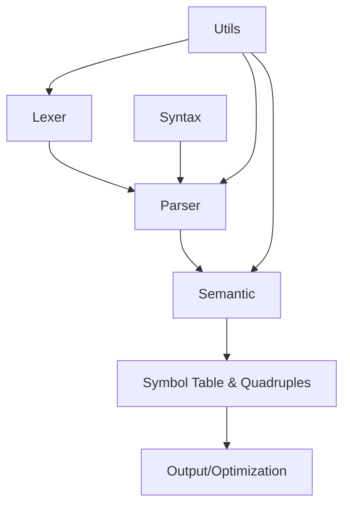

## 模块构成与模块间关系

该编译器项目包含多个模块，每个模块负责特定的功能，模块之间相互协作，共同完成从源代码的词法分析、语法分析、语义分析到生成中间代码的工作。项目的模块构成和各模块间的关系如下：

### 模块一：Lexer（词法分析模块）

**主要功能**：

* 通过 DFA（确定性有限自动机）对源代码进行扫描，识别出代码中的基本单元（Token），如标识符、操作符、数字、关键字等。
* 为语法分析提供 Token 列表。

**子模块**：

* **DFA 模块**：定义不同类型的 DFA 状态机，用于处理不同类型的 Token（如标识符、数字、操作符等）。
* **扫描器模块**：管理和注册各个 DFA，执行代码的逐字符扫描，并生成 Token。
* **Token 类型映射**：将识别到的字符流转换成编译器内部需要的符号（终结符）。

**输出**：

* Token 列表，作为后续语法分析的输入。

---

### 模块二：Parser（语法分析模块）

**主要功能**：

* 通过构建语法分析表（LR(0) 或 SLR(1)），将 Lexer 输出的 Token 列表转换为抽象语法树（AST）。
* 使用符号表和文法规则进行语法验证，确保源代码符合预定的语法结构。

**子模块**：

* **DFA 构建模块**：构建用于语法分析的 LR(0) 或 SLR(1) DFA 状态机。
* **语法分析表构建模块**：根据文法规则生成解析表，定义如何进行移进、归约操作。
* **语法分析模块**：根据语法分析表和 Token 列表进行语法分析，生成 AST 树。
* **错误处理模块**：捕捉语法错误并生成错误信息。

**输出**：

* 抽象语法树（AST）。
* 错误信息（若有语法错误）。

---

### 模块三：Semantic（语义分析模块）

**主要功能**：

* 进行语义检查，确保代码中的变量已声明且类型匹配。
* 生成符号表，用于追踪变量的定义、作用域及类型信息。
* 根据 AST 和符号表生成四元组，表示代码的中间表示。

**子模块**：

* **符号表管理模块**：管理符号（变量、函数等）在不同作用域中的声明和使用。
* **语义检查模块**：检查变量是否声明，类型是否匹配，是否存在语义错误。
* **四元组生成模块**：根据语法分析结果和语义分析生成四元组，表示程序的执行过程。

**输出**：

* 符号表。
* 四元组（中间代码表示）。
* 语义错误信息（若有）。

---

### 模块四：Syntax（语法规则模块）

**主要功能**：

* 定义语言的文法规则（例如声明语句、赋值语句、表达式等）。
* 提供语法符号（终结符和非终结符）及文法产生式，供语法分析器使用。

**子模块**：

* **文法规则定义模块**：定义语言的文法规则，如表达式、声明、控制流等。
* **符号分类模块**：将符号分为终结符（Token）和非终结符（语法符号）。

**输出**：

* 完整的文法规则。
* 符号分类（终结符和非终结符）。

---

### 模块五：Utils（工具模块）

**主要功能**：

* 提供辅助功能，如 Token 到符号的映射等。

**输出**：

* 各种工具函数，如符号与 Token 类型转换。

---

## 模块间关系

在该项目中，模块之间的关系和数据流如下：

1. **Lexer（词法分析模块）**：

   * 负责将源代码中的字符流转换为 Token 列表。每个 Token 类型都由不同的 DFA 状态机处理。
   * 将 Token 列表输出给 **Parser（语法分析模块）** 作为输入。

2. **Parser（语法分析模块）**：

   * 接收 Lexer 输出的 Token 列表，并根据文法规则进行语法分析，生成抽象语法树（AST）。
   * AST 中的节点信息会传递给 **Semantic（语义分析模块）** 进行语义检查。

3. **Semantic（语义分析模块）**：

   * 在 AST 的基础上，检查代码的语义是否正确（如变量是否声明、类型是否匹配）。
   * 生成符号表，检查变量、函数的声明和作用域信息。
   * 根据 AST 和符号表生成四元组作为中间代码。
   * 将符号表和四元组输出给 **后续优化或代码生成模块**（如果有）。

4. **Syntax（语法规则模块）**：

   * 定义语言的文法规则，包括表达式、语句等结构。
   * 提供给 **Parser（语法分析模块）** 用于生成语法分析表。

---

### 模块间流程图



* **Lexer** 通过 DFA 状态机对源代码进行逐字符扫描，生成 Token 列表，传递给 **Parser** 进行语法分析。
* **Parser** 根据语法规则（由 **Syntax** 模块提供）生成抽象语法树（AST），并将其传递给 **Semantic** 模块进行语义分析。
* **Semantic** 模块检查语法树的语义，生成符号表并生成四元组表示代码的中间表示。
* **Utils** 模块为各个模块提供辅助功能，如符号转换等。

### 支持的文法

```
S' -> Program

Program -> StmtList | StmtList EOF

Stmt -> Func | Decl | id = Expr ; | return Expr ; | Block 
      | if ( Cond ) Stmt | if ( Cond ) Stmt else Stmt 
      | while ( Cond ) Stmt | id MultiIndex = Expr ; 
      | id ( Args ) ; | for ( ForInit Cond ; Expr ) Stmt

Func -> Type id ( Args ) Block

Decl -> Type id = Expr ; | Type id MultiIndex ; 
      | Type id MultiIndex = Expr ; | Type id MultiIndex = InitList ;

Type -> type_kw

Block -> { StmtList }

StmtList -> ε | Stmt | StmtList Stmt

Expr -> Expr + Term | Expr - Term | Term | InitList | id = Expr
Term -> Term * CastExpr | Term / CastExpr | CastExpr

CastExpr -> CastPrefix Factor | Factor
CastPrefix -> ( Type )

Factor -> id ( Args ) | num | float | char | string | id 
        | ( Expr ) | id MultiIndex | - Factor

Args -> NonEmptyArgs | ε
NonEmptyArgs -> Expr | NonEmptyArgs , Expr
              | Type id | Type id = Expr
              | Type id MultiIndex | Type id MultiIndex = Expr
              | NonEmptyArgs , Type id | NonEmptyArgs , Type id = Expr
              | NonEmptyArgs , Type id MultiIndex | NonEmptyArgs , Type id MultiIndex = Expr

IndexList -> ε | Expr | IndexList , Expr

Cond -> Cond && Cond | Cond || Cond | ! Cond 
      | Expr < Expr | Expr > Expr | Expr <= Expr | Expr >= Expr 
      | Expr != Expr | Expr == Expr | ( Cond ) | Expr

MultiIndex -> ε | [ IndexList ] MultiIndex

InitList -> { } | { NonEmptyInitList }
NonEmptyInitList -> Expr | NonEmptyInitList , Expr

ForInit -> Decl | Expr | ε
```